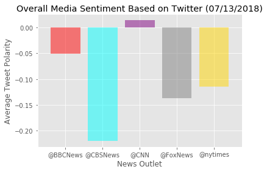

# Media Sentiment Analysis Using Twitter
## Analysis:
* The sentiment analysis can have different results depending on the number of tweets one examines. A trend that I've noticed while testing the code numerous times is that Fox News tends to have a more negative polarity in their tweets when compared to other news outlets.
* As I stated above, the sentiment analysis can be flawed because at one moment Fox could be more negative than the media outlets, but if one were to run the code again in 30 minutes, or an hour, the results could be altered drastically.
* One method to improve the sentiment analysis would be to use more randomly sampled tweets over a greater span of time. Doing so would remove the bias that could be coming into play when there is a tragedy or a politically charged event occuring, or having just occurred.


```python
import tweepy
import numpy as np
import pandas as pd
from datetime import datetime
import matplotlib.pyplot as plt
from matplotlib import style
style.use('ggplot')

from vaderSentiment.vaderSentiment import SentimentIntensityAnalyzer
analyzer = SentimentIntensityAnalyzer()

from config import (consumer_key, 
                    consumer_secret, 
                    access_token, 
                    access_token_secret)

auth = tweepy.OAuthHandler(consumer_key, consumer_secret)
auth.set_access_token(access_token, access_token_secret)
api = tweepy.API(auth, parser=tweepy.parsers.JSONParser())
```

## Tweepy Calls & Sentiment Analysis


```python
target_user = ("@FoxNews", "@CNN", "@nytimes", "@BBCNews", "@CBSNews")

sentiments = []

for user in target_user:
    counter = 1
    for x in range(5):
        public_tweets = api.user_timeline(user, count = 20)
        for tweet in public_tweets:
            results = analyzer.polarity_scores(tweet["text"])
            compound = results["compound"]
            pos = results["pos"]
            neu = results["neu"]
            neg = results["neg"]
            tweets_ago = counter
            sentiments.append({"Username": user,
                               "Text": tweet["text"],
                               "Date": tweet["created_at"], 
                               "Compound": compound,
                               "Positive": pos,
                               "Negative": neu,
                               "Neutral": neg,
                               "Tweets_Ago": counter})

            counter += 1
```

## Make Data Frame & Convert into CSV


```python
sentiments_pd = pd.DataFrame.from_dict(sentiments)
date = datetime.strptime(sentiments_pd["Date"][0],'%a %b %d %H:%M:%S +0000 %Y').strftime('%m/%d/%Y')
sentiments_pd.to_csv("Output/media_tweet_sentiments.csv", sep=',', encoding='utf-8', index = False)
sentiments_pd
```


<div>
<style scoped>
    .dataframe tbody tr th:only-of-type {
        vertical-align: middle;
    }

    .dataframe tbody tr th {
        vertical-align: top;
    }

    .dataframe thead th {
        text-align: right;
    }
</style>
<table border="1" class="dataframe">
  <thead>
    <tr style="text-align: right;">
      <th></th>
      <th>Compound</th>
      <th>Date</th>
      <th>Negative</th>
      <th>Neutral</th>
      <th>Positive</th>
      <th>Text</th>
      <th>Tweets_Ago</th>
      <th>Username</th>
    </tr>
  </thead>
  <tbody>
    <tr>
      <th>0</th>
      <td>-0.4767</td>
      <td>Sun Jun 10 20:03:02 +0000 2018</td>
      <td>0.846</td>
      <td>0.154</td>
      <td>0.000</td>
      <td>The Manhattan Beach Police Department has rele...</td>
      <td>1</td>
      <td>@FoxNews</td>
    </tr>
    <tr>
      <th>1</th>
      <td>0.6249</td>
      <td>Sun Jun 10 20:00:01 +0000 2018</td>
      <td>0.688</td>
      <td>0.073</td>
      <td>0.239</td>
      <td>.@marykissel: "A success in Singapore would be...</td>
      <td>2</td>
      <td>@FoxNews</td>
    </tr>
    <tr>
      <th>2</th>
      <td>0.0000</td>
      <td>Sun Jun 10 19:55:00 +0000 2018</td>
      <td>1.000</td>
      <td>0.000</td>
      <td>0.000</td>
      <td>U.S. markets so far this year. https://t.co/fC...</td>
      <td>3</td>
      <td>@FoxNews</td>
    </tr>
    <tr>
      <th>3</th>
      <td>-0.4404</td>
      <td>Sun Jun 10 19:46:35 +0000 2018</td>
      <td>0.674</td>
      <td>0.326</td>
      <td>0.000</td>
      <td>Coyote attacks teenager in Massachusetts: repo...</td>
      <td>4</td>
      <td>@FoxNews</td>
    </tr>
    <tr>
      <th>4</th>
      <td>-0.0772</td>
      <td>Sun Jun 10 19:45:07 +0000 2018</td>
      <td>0.695</td>
      <td>0.160</td>
      <td>0.144</td>
      <td>Pilot who landed plane after co-pilot was 'suc...</td>
      <td>5</td>
      <td>@FoxNews</td>
    </tr>
    <tr>
      <th>5</th>
      <td>-0.5859</td>
      <td>Sun Jun 10 19:45:00 +0000 2018</td>
      <td>0.609</td>
      <td>0.278</td>
      <td>0.113</td>
      <td>.@VP on Singapore summit: "After years of fail...</td>
      <td>6</td>
      <td>@FoxNews</td>
    </tr>
    <tr>
      <th>6</th>
      <td>0.0000</td>
      <td>Sun Jun 10 19:44:16 +0000 2018</td>
      <td>1.000</td>
      <td>0.000</td>
      <td>0.000</td>
      <td>RT @EricShawnTV: I anchor at 4pm @FoxNews alon...</td>
      <td>7</td>
      <td>@FoxNews</td>
    </tr>
    <tr>
      <th>7</th>
      <td>-0.7650</td>
      <td>Sun Jun 10 19:29:18 +0000 2018</td>
      <td>0.513</td>
      <td>0.487</td>
      <td>0.000</td>
      <td>Vince Vaughn arrested in California on DUI, re...</td>
      <td>8</td>
      <td>@FoxNews</td>
    </tr>
    <tr>
      <th>8</th>
      <td>0.0000</td>
      <td>Sun Jun 10 19:20:47 +0000 2018</td>
      <td>1.000</td>
      <td>0.000</td>
      <td>0.000</td>
      <td>"Our president is on schedule to forge a relat...</td>
      <td>9</td>
      <td>@FoxNews</td>
    </tr>
    <tr>
      <th>9</th>
      <td>0.3612</td>
      <td>Sun Jun 10 19:14:32 +0000 2018</td>
      <td>0.884</td>
      <td>0.000</td>
      <td>0.116</td>
      <td>.@POTUS: "Tariffs are going to come way down.....</td>
      <td>10</td>
      <td>@FoxNews</td>
    </tr>
    <tr>
      <th>10</th>
      <td>-0.5994</td>
      <td>Sun Jun 10 19:13:45 +0000 2018</td>
      <td>0.782</td>
      <td>0.218</td>
      <td>0.000</td>
      <td>.@SecretaryZinke: "We could end the war. It's ...</td>
      <td>11</td>
      <td>@FoxNews</td>
    </tr>
    <tr>
      <th>11</th>
      <td>-0.7906</td>
      <td>Sun Jun 10 19:04:55 +0000 2018</td>
      <td>0.562</td>
      <td>0.438</td>
      <td>0.000</td>
      <td>Ohio house explosion leaves 1 dead, another cr...</td>
      <td>12</td>
      <td>@FoxNews</td>
    </tr>
    <tr>
      <th>12</th>
      <td>-0.2960</td>
      <td>Sun Jun 10 18:55:34 +0000 2018</td>
      <td>0.699</td>
      <td>0.183</td>
      <td>0.118</td>
      <td>.@amazon admits to labor violations at factory...</td>
      <td>13</td>
      <td>@FoxNews</td>
    </tr>
    <tr>
      <th>13</th>
      <td>-0.3818</td>
      <td>Sun Jun 10 18:51:38 +0000 2018</td>
      <td>0.490</td>
      <td>0.265</td>
      <td>0.245</td>
      <td>Peter Navarro: "There's a special place in hel...</td>
      <td>14</td>
      <td>@FoxNews</td>
    </tr>
    <tr>
      <th>14</th>
      <td>-0.7579</td>
      <td>Sun Jun 10 18:43:32 +0000 2018</td>
      <td>0.667</td>
      <td>0.333</td>
      <td>0.000</td>
      <td>Sen. @OrrinHatch: North Korea should abandon h...</td>
      <td>15</td>
      <td>@FoxNews</td>
    </tr>
    <tr>
      <th>15</th>
      <td>-0.5267</td>
      <td>Sun Jun 10 18:37:19 +0000 2018</td>
      <td>0.746</td>
      <td>0.254</td>
      <td>0.000</td>
      <td>Dem Strategist Slams Trump's 'Behavior' in Off...</td>
      <td>16</td>
      <td>@FoxNews</td>
    </tr>
    <tr>
      <th>16</th>
      <td>-0.6369</td>
      <td>Sun Jun 10 18:30:29 +0000 2018</td>
      <td>0.634</td>
      <td>0.366</td>
      <td>0.000</td>
      <td>Lawyer in pasta assault must pay woman $103G, ...</td>
      <td>17</td>
      <td>@FoxNews</td>
    </tr>
    <tr>
      <th>17</th>
      <td>0.0000</td>
      <td>Sun Jun 10 18:26:00 +0000 2018</td>
      <td>1.000</td>
      <td>0.000</td>
      <td>0.000</td>
      <td>TONIGHT: @BretBaier is live in Singapore ahead...</td>
      <td>18</td>
      <td>@FoxNews</td>
    </tr>
    <tr>
      <th>18</th>
      <td>-0.5719</td>
      <td>Sun Jun 10 18:09:05 +0000 2018</td>
      <td>0.583</td>
      <td>0.291</td>
      <td>0.126</td>
      <td>'Dancing' Georgia doctor is suspended by medic...</td>
      <td>19</td>
      <td>@FoxNews</td>
    </tr>
    <tr>
      <th>19</th>
      <td>0.0000</td>
      <td>Sun Jun 10 17:58:00 +0000 2018</td>
      <td>1.000</td>
      <td>0.000</td>
      <td>0.000</td>
      <td>Woman dies 10 days after her husband of 46 yea...</td>
      <td>20</td>
      <td>@FoxNews</td>
    </tr>
    <tr>
      <th>20</th>
      <td>-0.4767</td>
      <td>Sun Jun 10 20:03:02 +0000 2018</td>
      <td>0.846</td>
      <td>0.154</td>
      <td>0.000</td>
      <td>The Manhattan Beach Police Department has rele...</td>
      <td>21</td>
      <td>@FoxNews</td>
    </tr>
    <tr>
      <th>21</th>
      <td>0.6249</td>
      <td>Sun Jun 10 20:00:01 +0000 2018</td>
      <td>0.688</td>
      <td>0.073</td>
      <td>0.239</td>
      <td>.@marykissel: "A success in Singapore would be...</td>
      <td>22</td>
      <td>@FoxNews</td>
    </tr>
    <tr>
      <th>22</th>
      <td>0.0000</td>
      <td>Sun Jun 10 19:55:00 +0000 2018</td>
      <td>1.000</td>
      <td>0.000</td>
      <td>0.000</td>
      <td>U.S. markets so far this year. https://t.co/fC...</td>
      <td>23</td>
      <td>@FoxNews</td>
    </tr>
    <tr>
      <th>23</th>
      <td>-0.4404</td>
      <td>Sun Jun 10 19:46:35 +0000 2018</td>
      <td>0.674</td>
      <td>0.326</td>
      <td>0.000</td>
      <td>Coyote attacks teenager in Massachusetts: repo...</td>
      <td>24</td>
      <td>@FoxNews</td>
    </tr>
    <tr>
      <th>24</th>
      <td>-0.0772</td>
      <td>Sun Jun 10 19:45:07 +0000 2018</td>
      <td>0.695</td>
      <td>0.160</td>
      <td>0.144</td>
      <td>Pilot who landed plane after co-pilot was 'suc...</td>
      <td>25</td>
      <td>@FoxNews</td>
    </tr>
    <tr>
      <th>25</th>
      <td>-0.5859</td>
      <td>Sun Jun 10 19:45:00 +0000 2018</td>
      <td>0.609</td>
      <td>0.278</td>
      <td>0.113</td>
      <td>.@VP on Singapore summit: "After years of fail...</td>
      <td>26</td>
      <td>@FoxNews</td>
    </tr>
    <tr>
      <th>26</th>
      <td>0.0000</td>
      <td>Sun Jun 10 19:44:16 +0000 2018</td>
      <td>1.000</td>
      <td>0.000</td>
      <td>0.000</td>
      <td>RT @EricShawnTV: I anchor at 4pm @FoxNews alon...</td>
      <td>27</td>
      <td>@FoxNews</td>
    </tr>
    <tr>
      <th>27</th>
      <td>-0.7650</td>
      <td>Sun Jun 10 19:29:18 +0000 2018</td>
      <td>0.513</td>
      <td>0.487</td>
      <td>0.000</td>
      <td>Vince Vaughn arrested in California on DUI, re...</td>
      <td>28</td>
      <td>@FoxNews</td>
    </tr>
    <tr>
      <th>28</th>
      <td>0.0000</td>
      <td>Sun Jun 10 19:20:47 +0000 2018</td>
      <td>1.000</td>
      <td>0.000</td>
      <td>0.000</td>
      <td>"Our president is on schedule to forge a relat...</td>
      <td>29</td>
      <td>@FoxNews</td>
    </tr>
    <tr>
      <th>29</th>
      <td>0.3612</td>
      <td>Sun Jun 10 19:14:32 +0000 2018</td>
      <td>0.884</td>
      <td>0.000</td>
      <td>0.116</td>
      <td>.@POTUS: "Tariffs are going to come way down.....</td>
      <td>30</td>
      <td>@FoxNews</td>
    </tr>
    <tr>
      <th>...</th>
      <td>...</td>
      <td>...</td>
      <td>...</td>
      <td>...</td>
      <td>...</td>
      <td>...</td>
      <td>...</td>
      <td>...</td>
    </tr>
    <tr>
      <th>470</th>
      <td>-0.6044</td>
      <td>Sun Jun 10 17:34:18 +0000 2018</td>
      <td>0.771</td>
      <td>0.229</td>
      <td>0.000</td>
      <td>"What's not in good faith is when you leave th...</td>
      <td>71</td>
      <td>@CBSNews</td>
    </tr>
    <tr>
      <th>471</th>
      <td>-0.1695</td>
      <td>Sun Jun 10 17:22:51 +0000 2018</td>
      <td>0.926</td>
      <td>0.074</td>
      <td>0.000</td>
      <td>"He's not going to allow the people to suddenl...</td>
      <td>72</td>
      <td>@CBSNews</td>
    </tr>
    <tr>
      <th>472</th>
      <td>-0.3818</td>
      <td>Sun Jun 10 17:19:39 +0000 2018</td>
      <td>0.670</td>
      <td>0.201</td>
      <td>0.129</td>
      <td>Restaurant CEO who says Anthony Bourdain chang...</td>
      <td>73</td>
      <td>@CBSNews</td>
    </tr>
    <tr>
      <th>473</th>
      <td>0.2263</td>
      <td>Sun Jun 10 17:00:01 +0000 2018</td>
      <td>0.773</td>
      <td>0.094</td>
      <td>0.133</td>
      <td>Citing Democrats' exclusion from summit prepar...</td>
      <td>74</td>
      <td>@CBSNews</td>
    </tr>
    <tr>
      <th>474</th>
      <td>0.1779</td>
      <td>Sun Jun 10 16:54:46 +0000 2018</td>
      <td>0.642</td>
      <td>0.160</td>
      <td>0.198</td>
      <td>Rafael Nadal wins 11th French Open title, beat...</td>
      <td>75</td>
      <td>@CBSNews</td>
    </tr>
    <tr>
      <th>475</th>
      <td>-0.3182</td>
      <td>Sun Jun 10 16:40:07 +0000 2018</td>
      <td>0.905</td>
      <td>0.095</td>
      <td>0.000</td>
      <td>MOOSE MAYHEM: When a baby moose got loose on t...</td>
      <td>76</td>
      <td>@CBSNews</td>
    </tr>
    <tr>
      <th>476</th>
      <td>-0.2182</td>
      <td>Sun Jun 10 16:27:56 +0000 2018</td>
      <td>0.824</td>
      <td>0.129</td>
      <td>0.048</td>
      <td>"The fact of the matter is that I believe the ...</td>
      <td>77</td>
      <td>@CBSNews</td>
    </tr>
    <tr>
      <th>477</th>
      <td>-0.5256</td>
      <td>Sun Jun 10 16:19:48 +0000 2018</td>
      <td>0.855</td>
      <td>0.145</td>
      <td>0.000</td>
      <td>Susan Rice said that the U.S now finds itself ...</td>
      <td>78</td>
      <td>@CBSNews</td>
    </tr>
    <tr>
      <th>478</th>
      <td>0.0000</td>
      <td>Sun Jun 10 16:10:29 +0000 2018</td>
      <td>1.000</td>
      <td>0.000</td>
      <td>0.000</td>
      <td>North Korea summit must be more than "one-and-...</td>
      <td>79</td>
      <td>@CBSNews</td>
    </tr>
    <tr>
      <th>479</th>
      <td>0.6310</td>
      <td>Sun Jun 10 16:00:09 +0000 2018</td>
      <td>0.795</td>
      <td>0.000</td>
      <td>0.205</td>
      <td>You’ve heard about the caravan of migrants hop...</td>
      <td>80</td>
      <td>@CBSNews</td>
    </tr>
    <tr>
      <th>480</th>
      <td>0.5106</td>
      <td>Sun Jun 10 19:59:48 +0000 2018</td>
      <td>0.837</td>
      <td>0.000</td>
      <td>0.163</td>
      <td>Nearly nine months after Hurricane Maria rocke...</td>
      <td>81</td>
      <td>@CBSNews</td>
    </tr>
    <tr>
      <th>481</th>
      <td>-0.6597</td>
      <td>Sun Jun 10 19:40:01 +0000 2018</td>
      <td>0.758</td>
      <td>0.242</td>
      <td>0.000</td>
      <td>As the Miss America moves away from its pagean...</td>
      <td>82</td>
      <td>@CBSNews</td>
    </tr>
    <tr>
      <th>482</th>
      <td>-0.2960</td>
      <td>Sun Jun 10 19:19:53 +0000 2018</td>
      <td>0.885</td>
      <td>0.115</td>
      <td>0.000</td>
      <td>Lauren Ridloff, a stay-at-home mom with no pro...</td>
      <td>83</td>
      <td>@CBSNews</td>
    </tr>
    <tr>
      <th>483</th>
      <td>-0.8126</td>
      <td>Sun Jun 10 18:59:36 +0000 2018</td>
      <td>0.656</td>
      <td>0.344</td>
      <td>0.000</td>
      <td>Suicide is escalating throughout the U.S.— exp...</td>
      <td>84</td>
      <td>@CBSNews</td>
    </tr>
    <tr>
      <th>484</th>
      <td>-0.3182</td>
      <td>Sun Jun 10 18:59:35 +0000 2018</td>
      <td>0.881</td>
      <td>0.119</td>
      <td>0.000</td>
      <td>Hurricane Aletta weakened rapidly to a Categor...</td>
      <td>85</td>
      <td>@CBSNews</td>
    </tr>
    <tr>
      <th>485</th>
      <td>-0.7184</td>
      <td>Sun Jun 10 18:40:11 +0000 2018</td>
      <td>0.760</td>
      <td>0.240</td>
      <td>0.000</td>
      <td>WATCH: When this man got pulled over for alleg...</td>
      <td>86</td>
      <td>@CBSNews</td>
    </tr>
    <tr>
      <th>486</th>
      <td>-0.4215</td>
      <td>Sun Jun 10 18:19:39 +0000 2018</td>
      <td>0.714</td>
      <td>0.179</td>
      <td>0.107</td>
      <td>The American special forces soldier killed in ...</td>
      <td>87</td>
      <td>@CBSNews</td>
    </tr>
    <tr>
      <th>487</th>
      <td>0.0000</td>
      <td>Sun Jun 10 18:00:14 +0000 2018</td>
      <td>0.827</td>
      <td>0.087</td>
      <td>0.087</td>
      <td>With only $10 in his pocket and no prospect of...</td>
      <td>88</td>
      <td>@CBSNews</td>
    </tr>
    <tr>
      <th>488</th>
      <td>0.0000</td>
      <td>Sun Jun 10 17:46:36 +0000 2018</td>
      <td>1.000</td>
      <td>0.000</td>
      <td>0.000</td>
      <td>@margbrennan "They were kicked out after invad...</td>
      <td>89</td>
      <td>@CBSNews</td>
    </tr>
    <tr>
      <th>489</th>
      <td>0.1280</td>
      <td>Sun Jun 10 17:39:32 +0000 2018</td>
      <td>0.754</td>
      <td>0.111</td>
      <td>0.136</td>
      <td>Kenneth Starr says there's "no question" there...</td>
      <td>90</td>
      <td>@CBSNews</td>
    </tr>
    <tr>
      <th>490</th>
      <td>-0.6044</td>
      <td>Sun Jun 10 17:34:18 +0000 2018</td>
      <td>0.771</td>
      <td>0.229</td>
      <td>0.000</td>
      <td>"What's not in good faith is when you leave th...</td>
      <td>91</td>
      <td>@CBSNews</td>
    </tr>
    <tr>
      <th>491</th>
      <td>-0.1695</td>
      <td>Sun Jun 10 17:22:51 +0000 2018</td>
      <td>0.926</td>
      <td>0.074</td>
      <td>0.000</td>
      <td>"He's not going to allow the people to suddenl...</td>
      <td>92</td>
      <td>@CBSNews</td>
    </tr>
    <tr>
      <th>492</th>
      <td>-0.3818</td>
      <td>Sun Jun 10 17:19:39 +0000 2018</td>
      <td>0.670</td>
      <td>0.201</td>
      <td>0.129</td>
      <td>Restaurant CEO who says Anthony Bourdain chang...</td>
      <td>93</td>
      <td>@CBSNews</td>
    </tr>
    <tr>
      <th>493</th>
      <td>0.2263</td>
      <td>Sun Jun 10 17:00:01 +0000 2018</td>
      <td>0.773</td>
      <td>0.094</td>
      <td>0.133</td>
      <td>Citing Democrats' exclusion from summit prepar...</td>
      <td>94</td>
      <td>@CBSNews</td>
    </tr>
    <tr>
      <th>494</th>
      <td>0.1779</td>
      <td>Sun Jun 10 16:54:46 +0000 2018</td>
      <td>0.642</td>
      <td>0.160</td>
      <td>0.198</td>
      <td>Rafael Nadal wins 11th French Open title, beat...</td>
      <td>95</td>
      <td>@CBSNews</td>
    </tr>
    <tr>
      <th>495</th>
      <td>-0.3182</td>
      <td>Sun Jun 10 16:40:07 +0000 2018</td>
      <td>0.905</td>
      <td>0.095</td>
      <td>0.000</td>
      <td>MOOSE MAYHEM: When a baby moose got loose on t...</td>
      <td>96</td>
      <td>@CBSNews</td>
    </tr>
    <tr>
      <th>496</th>
      <td>-0.2182</td>
      <td>Sun Jun 10 16:27:56 +0000 2018</td>
      <td>0.824</td>
      <td>0.129</td>
      <td>0.048</td>
      <td>"The fact of the matter is that I believe the ...</td>
      <td>97</td>
      <td>@CBSNews</td>
    </tr>
    <tr>
      <th>497</th>
      <td>-0.5256</td>
      <td>Sun Jun 10 16:19:48 +0000 2018</td>
      <td>0.855</td>
      <td>0.145</td>
      <td>0.000</td>
      <td>Susan Rice said that the U.S now finds itself ...</td>
      <td>98</td>
      <td>@CBSNews</td>
    </tr>
    <tr>
      <th>498</th>
      <td>0.0000</td>
      <td>Sun Jun 10 16:10:29 +0000 2018</td>
      <td>1.000</td>
      <td>0.000</td>
      <td>0.000</td>
      <td>North Korea summit must be more than "one-and-...</td>
      <td>99</td>
      <td>@CBSNews</td>
    </tr>
    <tr>
      <th>499</th>
      <td>0.6310</td>
      <td>Sun Jun 10 16:00:09 +0000 2018</td>
      <td>0.795</td>
      <td>0.000</td>
      <td>0.205</td>
      <td>You’ve heard about the caravan of migrants hop...</td>
      <td>100</td>
      <td>@CBSNews</td>
    </tr>
  </tbody>
</table>
<p>500 rows × 8 columns</p>
</div>


```python
sentiments_pd.count()
```


    Compound      500
    Date          500
    Negative      500
    Neutral       500
    Positive      500
    Text          500
    Tweets_Ago    500
    Username      500
    dtype: int64


```python
avg_sentiments_df = sentiments_pd[["Username","Compound"]].groupby(["Username"])["Compound"].mean()
avg_sentiments_df = pd.DataFrame(avg_sentiments_df).reset_index()
avg_sentiments_df = avg_sentiments_df.rename(columns={ "Compound" : "Average Polarity"})
avg_sentiments_df
```


<div>
<style scoped>
    .dataframe tbody tr th:only-of-type {
        vertical-align: middle;
    }

    .dataframe tbody tr th {
        vertical-align: top;
    }

    .dataframe thead th {
        text-align: right;
    }
</style>
<table border="1" class="dataframe">
  <thead>
    <tr style="text-align: right;">
      <th></th>
      <th>Username</th>
      <th>Average Polarity</th>
    </tr>
  </thead>
  <tbody>
    <tr>
      <th>0</th>
      <td>@BBCNews</td>
      <td>0.121335</td>
    </tr>
    <tr>
      <th>1</th>
      <td>@CBSNews</td>
      <td>-0.188515</td>
    </tr>
    <tr>
      <th>2</th>
      <td>@CNN</td>
      <td>-0.055955</td>
    </tr>
    <tr>
      <th>3</th>
      <td>@FoxNews</td>
      <td>-0.296015</td>
    </tr>
    <tr>
      <th>4</th>
      <td>@nytimes</td>
      <td>0.033895</td>
    </tr>
  </tbody>
</table>
</div>


## Scatter Plot
### Shows the tweet sentiments of the tweets from each news outlet


```python
groups = sentiments_pd.groupby('Username')
fig, ax = plt.subplots()
ax.margins(0.05)
for name, group in groups:
    x = group.Tweets_Ago
    y = group.Compound
    ax.plot(x,y, marker='o',markeredgecolor="black", linestyle='', ms=7, label=name)
box = ax.get_position()
ax.set_position([box.x0, box.y0, box.width * 0.8, box.height])
ax.legend(loc='center left', bbox_to_anchor=(1, 0.5))
plt.xlim(-10,110)
plt.xlabel("Tweets Ago")
plt.ylabel("Tweet Polarity")
plt.title(f"Sentiment Analysis of Media Tweets ({date})")
plt.ylim(-1,1)
plt.xlim([x.max(),x.min()])
plt.savefig("Output/Sentiment_Analysis.png")
plt.show()
```


## Bar Chart
### Highlights the overall tweet sentiments for various news outlets


```python
y_vals = avg_sentiments_df["Average Polarity"]
x_axis = np.arange(len(y_vals))
labels = avg_sentiments_df["Username"]
colors = ["red", "cyan", "purple", "grey", "gold"]
plt.bar(x_axis, y_vals, alpha=0.5, align="center", color = colors)
tick_locations = [value for value in x_axis]
plt.xticks(tick_locations, labels)
plt.xlim(-0.75, len(x_axis)-0.25)
plt.title(f"Overall Media Sentiment Based on Twitter ({date})")
plt.xlabel("News Outlet")
plt.ylabel("Average Tweet Polarity")
plt.savefig("Output/Overall_Analysis.png")
plt.show()
```




