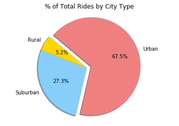

# Pyber HW Assignment
* Pyber fares increase in less populus areas such as rural communities as opposed to urban/suburban communities. Also, the number of drivers in rural areas is significantly lower than those found in urban areas.
* A bulk of the business is urban-centered in the sense that a majority of all company rides (67.5%) and company drivers (77.8%) are in the urban environment. As a result, the needs of the urban customer should be the focus of the company when marketting Pyber's services.
* The rural market serves as a very small fraction of Pyber's customer base while the Urban market dominates in both drivers and riders. The Suburban market represents nearly a third of all fare profit and total rides while only having approximately 20% of the total drivers.


```python
import matplotlib.pyplot as plt
import numpy as np
import pandas as pd
```


```python
file1 = '../raw_data/ride_data.csv'
file2 = '../raw_data/city_data.csv'
ride_df = pd.read_csv(file1)
city_df = pd.read_csv(file2)
ride_df.head()
```


<div>
<style scoped>
    .dataframe tbody tr th:only-of-type {
        vertical-align: middle;
    }

    .dataframe tbody tr th {
        vertical-align: top;
    }

    .dataframe thead th {
        text-align: right;
    }
</style>
<table border="1" class="dataframe">
  <thead>
    <tr style="text-align: right;">
      <th></th>
      <th>city</th>
      <th>date</th>
      <th>fare</th>
      <th>ride_id</th>
    </tr>
  </thead>
  <tbody>
    <tr>
      <th>0</th>
      <td>Sarabury</td>
      <td>2016-01-16 13:49:27</td>
      <td>38.35</td>
      <td>5403689035038</td>
    </tr>
    <tr>
      <th>1</th>
      <td>South Roy</td>
      <td>2016-01-02 18:42:34</td>
      <td>17.49</td>
      <td>4036272335942</td>
    </tr>
    <tr>
      <th>2</th>
      <td>Wiseborough</td>
      <td>2016-01-21 17:35:29</td>
      <td>44.18</td>
      <td>3645042422587</td>
    </tr>
    <tr>
      <th>3</th>
      <td>Spencertown</td>
      <td>2016-07-31 14:53:22</td>
      <td>6.87</td>
      <td>2242596575892</td>
    </tr>
    <tr>
      <th>4</th>
      <td>Nguyenbury</td>
      <td>2016-07-09 04:42:44</td>
      <td>6.28</td>
      <td>1543057793673</td>
    </tr>
  </tbody>
</table>
</div>


```python
city_df.head()
```


<div>
<style scoped>
    .dataframe tbody tr th:only-of-type {
        vertical-align: middle;
    }

    .dataframe tbody tr th {
        vertical-align: top;
    }

    .dataframe thead th {
        text-align: right;
    }
</style>
<table border="1" class="dataframe">
  <thead>
    <tr style="text-align: right;">
      <th></th>
      <th>city</th>
      <th>driver_count</th>
      <th>type</th>
    </tr>
  </thead>
  <tbody>
    <tr>
      <th>0</th>
      <td>Kelseyland</td>
      <td>63</td>
      <td>Urban</td>
    </tr>
    <tr>
      <th>1</th>
      <td>Nguyenbury</td>
      <td>8</td>
      <td>Urban</td>
    </tr>
    <tr>
      <th>2</th>
      <td>East Douglas</td>
      <td>12</td>
      <td>Urban</td>
    </tr>
    <tr>
      <th>3</th>
      <td>West Dawnfurt</td>
      <td>34</td>
      <td>Urban</td>
    </tr>
    <tr>
      <th>4</th>
      <td>Rodriguezburgh</td>
      <td>52</td>
      <td>Urban</td>
    </tr>
  </tbody>
</table>
</div>


```python
merged_df = pd.merge(ride_df, city_df, how='left', on=['city'])
merged_df.head(10)
```


<div>
<style scoped>
    .dataframe tbody tr th:only-of-type {
        vertical-align: middle;
    }

    .dataframe tbody tr th {
        vertical-align: top;
    }

    .dataframe thead th {
        text-align: right;
    }
</style>
<table border="1" class="dataframe">
  <thead>
    <tr style="text-align: right;">
      <th></th>
      <th>city</th>
      <th>date</th>
      <th>fare</th>
      <th>ride_id</th>
      <th>driver_count</th>
      <th>type</th>
    </tr>
  </thead>
  <tbody>
    <tr>
      <th>0</th>
      <td>Sarabury</td>
      <td>2016-01-16 13:49:27</td>
      <td>38.35</td>
      <td>5403689035038</td>
      <td>46</td>
      <td>Urban</td>
    </tr>
    <tr>
      <th>1</th>
      <td>South Roy</td>
      <td>2016-01-02 18:42:34</td>
      <td>17.49</td>
      <td>4036272335942</td>
      <td>35</td>
      <td>Urban</td>
    </tr>
    <tr>
      <th>2</th>
      <td>Wiseborough</td>
      <td>2016-01-21 17:35:29</td>
      <td>44.18</td>
      <td>3645042422587</td>
      <td>55</td>
      <td>Urban</td>
    </tr>
    <tr>
      <th>3</th>
      <td>Spencertown</td>
      <td>2016-07-31 14:53:22</td>
      <td>6.87</td>
      <td>2242596575892</td>
      <td>68</td>
      <td>Urban</td>
    </tr>
    <tr>
      <th>4</th>
      <td>Nguyenbury</td>
      <td>2016-07-09 04:42:44</td>
      <td>6.28</td>
      <td>1543057793673</td>
      <td>8</td>
      <td>Urban</td>
    </tr>
    <tr>
      <th>5</th>
      <td>New Jeffrey</td>
      <td>2016-02-22 18:36:25</td>
      <td>36.01</td>
      <td>9757888452346</td>
      <td>58</td>
      <td>Urban</td>
    </tr>
    <tr>
      <th>6</th>
      <td>Port Johnstad</td>
      <td>2016-06-07 02:39:58</td>
      <td>17.15</td>
      <td>4352278259335</td>
      <td>22</td>
      <td>Urban</td>
    </tr>
    <tr>
      <th>7</th>
      <td>Jacobfort</td>
      <td>2016-09-20 20:58:37</td>
      <td>22.98</td>
      <td>1500221409082</td>
      <td>52</td>
      <td>Urban</td>
    </tr>
    <tr>
      <th>8</th>
      <td>Travisville</td>
      <td>2016-01-15 17:32:02</td>
      <td>27.39</td>
      <td>850152768361</td>
      <td>37</td>
      <td>Urban</td>
    </tr>
    <tr>
      <th>9</th>
      <td>Sandymouth</td>
      <td>2016-11-16 07:27:00</td>
      <td>21.61</td>
      <td>2389035050524</td>
      <td>11</td>
      <td>Urban</td>
    </tr>
  </tbody>
</table>
</div>


```python
bubble_chart = city_df
avg_fare = ride_df[["city","fare"]].groupby(["city"]).mean()
avg_fare = avg_fare.reset_index()
avg_fare["fare"] = avg_fare["fare"].apply('{:.2f}'.format)
avg_fare_df = pd.DataFrame(avg_fare)
grouped_rides = ride_df.groupby(["city"])
ride_count = grouped_rides["ride_id"].count()
ride_count_df = pd.DataFrame(ride_count)
ride_count_df = ride_count_df.reset_index()
bubble_chart = pd.merge(bubble_chart, avg_fare_df, how='left', on=['city'])
bubble_chart = pd.merge(bubble_chart, ride_count_df, how='left', on=['city'])
bubble_chart = bubble_chart.rename(columns={ "city" : "City",
                                             "driver_count" : "Driver Count",
                                             "type" : "Type",
                                             "fare" : "Average Fare ($)",
                                             "ride_id": "Ride Count"})
color_dict = {"Urban": "gold", "Suburban": "lightskyblue", "Rural": "lightcoral"}
bubble_chart['Color'] = bubble_chart['Type'].map(color_dict)
bubble_chart.head(10)

```


<div>
<style scoped>
    .dataframe tbody tr th:only-of-type {
        vertical-align: middle;
    }

    .dataframe tbody tr th {
        vertical-align: top;
    }

    .dataframe thead th {
        text-align: right;
    }
</style>
<table border="1" class="dataframe">
  <thead>
    <tr style="text-align: right;">
      <th></th>
      <th>City</th>
      <th>Driver Count</th>
      <th>Type</th>
      <th>Average Fare ($)</th>
      <th>Ride Count</th>
      <th>Color</th>
    </tr>
  </thead>
  <tbody>
    <tr>
      <th>0</th>
      <td>Kelseyland</td>
      <td>63</td>
      <td>Urban</td>
      <td>21.81</td>
      <td>28</td>
      <td>gold</td>
    </tr>
    <tr>
      <th>1</th>
      <td>Nguyenbury</td>
      <td>8</td>
      <td>Urban</td>
      <td>25.90</td>
      <td>26</td>
      <td>gold</td>
    </tr>
    <tr>
      <th>2</th>
      <td>East Douglas</td>
      <td>12</td>
      <td>Urban</td>
      <td>26.17</td>
      <td>22</td>
      <td>gold</td>
    </tr>
    <tr>
      <th>3</th>
      <td>West Dawnfurt</td>
      <td>34</td>
      <td>Urban</td>
      <td>22.33</td>
      <td>29</td>
      <td>gold</td>
    </tr>
    <tr>
      <th>4</th>
      <td>Rodriguezburgh</td>
      <td>52</td>
      <td>Urban</td>
      <td>21.33</td>
      <td>23</td>
      <td>gold</td>
    </tr>
    <tr>
      <th>5</th>
      <td>South Josephville</td>
      <td>4</td>
      <td>Urban</td>
      <td>26.82</td>
      <td>24</td>
      <td>gold</td>
    </tr>
    <tr>
      <th>6</th>
      <td>West Sydneyhaven</td>
      <td>70</td>
      <td>Urban</td>
      <td>22.37</td>
      <td>18</td>
      <td>gold</td>
    </tr>
    <tr>
      <th>7</th>
      <td>Travisville</td>
      <td>37</td>
      <td>Urban</td>
      <td>27.22</td>
      <td>23</td>
      <td>gold</td>
    </tr>
    <tr>
      <th>8</th>
      <td>Torresshire</td>
      <td>70</td>
      <td>Urban</td>
      <td>24.21</td>
      <td>26</td>
      <td>gold</td>
    </tr>
    <tr>
      <th>9</th>
      <td>Lisaville</td>
      <td>66</td>
      <td>Urban</td>
      <td>28.43</td>
      <td>28</td>
      <td>gold</td>
    </tr>
  </tbody>
</table>
</div>


# Bubble Chart
* Average Fare ($) Per City
* Total Number of Rides Per City
* Total Number of Drivers Per City
* City Type (Urban, Suburban, Rural)


```python
import matplotlib.patches as mpatches
avg_fare = bubble_chart["Average Fare ($)"]
tot_rides = bubble_chart["Ride Count"]
tot_drive = bubble_chart["Driver Count"]
colors = bubble_chart["Color"]
labels = bubble_chart["Type"]
plt.scatter(x = tot_rides, y = avg_fare, s = tot_drive, c = colors, marker="o")
plt.legend(('Urban', 'Suburban', 'Rural'))
plt.ylim(-2,130)
plt.yticks(np.arange(0, 130, step=15))
plt.grid()
classes = ['Urban', 'Suburban', 'Rural']
class_colours = ["gold", "lightskyblue", "lightcoral"]
recs = []
for i in range(0,len(class_colours)):
    recs.append(mpatches.Rectangle((0,0),1,1,fc=class_colours[i]))
plt.legend(recs,classes)
plt.title("Average Fare vs Number of Rides")
plt.xlabel("Total Number of Rides")
plt.ylabel("Average Fare ($)")
plt.show()
```


# Pie Charts
* % of Total Fares by City Type
* % of Total Rides by City Type
* % of Total Drivers by City Type


```python
total_fares = merged_df[["type","fare"]].groupby(["type"]).sum()
total_fares = total_fares.reset_index()
fares = total_fares["fare"]
labels = total_fares["type"]
colors = ["gold", "lightskyblue", "lightcoral"]
explode = [0, 0, 0.1]
plt.pie(fares, shadow=True, explode = explode, colors = colors, labels=labels,
        autopct="%1.1f%%", startangle=140)
plt.axis("equal")
plt.title("% of Total Fares by City Type")
plt.show()
```


```python
rides = bubble_chart[["Type","Ride Count"]].groupby(["Type"]).sum()
rides = rides.reset_index()
labels = rides["Type"]
colors = ["gold", "lightskyblue", "lightcoral"]
explode = [0, 0, 0.1]
plt.pie(rides["Ride Count"], shadow=True, explode = explode, colors = colors, labels=labels,
        autopct="%1.1f%%", startangle=140)
plt.axis("equal")
plt.title("% of Total Rides by City Type")
plt.show()
```





```python
driver_c = bubble_chart[["Type","Driver Count"]].groupby(["Type"]).sum()
driver_c = driver_c.reset_index()
labels = driver_c["Type"]
colors = ["gold", "lightskyblue", "lightcoral"]
explode = [0, 0, 0.1]
plt.pie(driver_c["Driver Count"], shadow=True, explode = explode, colors = colors, labels=labels,
        autopct="%1.1f%%", startangle=180)
plt.axis("equal")
plt.title("% of Total Drivers by City Type")
plt.show()
```


