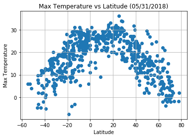

# Weatherpy

## Analysis
* As shown in the Max Temperature vs. Latitude Plot, one can clearly see that the temperature recorded in cities gradually reaches a peak as one travels from one pole of the planet to the other; in other words, the planet is warmer along its equator.
* Upon analysis of the Wind Speed and Cloudiness, it would seem that there is little to no correlation between Latitude and Wind Speed or Cloudiness. However, it would appear that towards the equator, there is more moisture in the air, as shown in the Humidity vs. Latitude Plot. When examining the plot, there is almost always a gap near the equatorial Latitude (0) on the scatter plot due to cities on, or near, the equator having high humidity.
* One issue with this method of analysis is that not all cities have data collected from the openweathermap api and as a result, one should have a buffer zone of approximately 100 for a sample size of 500. To resolve this, one could generate cities and call their data while simultaneously checking if the city exists in the database. From there a flag could be raised and an if-else construct could be used to filter out the cities that don't have data and replace them with one that does.


```python
from citipy import citipy
import random
import matplotlib.pyplot as plt
import openweathermapy as ow
import pandas as pd
from configweather import api_key
```

## Generate Cities List
Something to keep in mind when doing this analysis was the distribution of land, and therefore cities, on the planet. For example, Earth is very "top-heavy" in the sense that "land areas are distributed predominantly in the Northern Hemisphere (68%) relative to the Southern Hemisphere (32%) as divided by the equator" (http://phl.upr.edu/library/notes/distributionoflandmassesofthepaleo-earth). A similar behavior is exhibited when comparing the Eastern and Western Hemispheres as well, with the East having nearly double that of the West. This can create a skewed analysis due to the fact that a majority of cities would be expected to be in the hemispheres with the greatest amount of land. I've combatted this bias by implementing a simple "if-elseif" construct to sample the 4 quadrants of the world for cities.

To avoid duplicate cities, I've implemented an if-statement which checks if the newly generated city is already in the cities list, if so it won't append the duplicate to the list.


```python
cities = []
samplesize = 700
i = 0

def generate_city(latitude, longitude):
    while(True):
        city = citipy.nearest_city(lat, lon)
        cityname = city.city_name
        if (~(cityname in cities)):
            cities.append(cityname)
            break


while (i < samplesize):
    if i < (samplesize/4) :
        lat = random.randint(-90,0)
        lon = random.randint(-180,0)
    elif i < (samplesize/2):
        lat = random.randint(0,90)
        lon = random.randint(-180,0)
    elif i < (samplesize*(3/4)):
        lat = random.randint(-90,0)
        lon = random.randint(0,180)
    else:
        lat = random.randint(0,90)
        lon = random.randint(0,180)
    generate_city(lat, lon)
    i = i + 1
```

## Perform API Calls


```python
weather_data = []
counter = 1
settings = {"units": "metric", "appid": api_key}
print("Beginning Data Retrieval\n------------------------")
url = "http://api.openweathermap.org/data/2.5/weather?"
units = "metric"
for city in cities:    
    print(f"Processing city {counter} of {samplesize} | {city}")
    cityjoined = "_".join(city.split())
    counter = counter + 1
    try:
        weather_data.append(ow.get_current(city, **settings))
        query_url = f"{url}appid={api_key}&q={cityjoined}&units={units}"
        print(query_url)
    except:
        print(f"Data for {city} not found.")
        
print("------------------------\nData Retrieval Complete\n------------------------")
```

    Beginning Data Retrieval
    ------------------------
    Processing city 1 of 700 | mataura
    http://api.openweathermap.org/data/2.5/weather?appid=da015cf534cbe2d698015acc069c1e9e&q=mataura&units=metric
    Processing city 2 of 700 | georgetown
    http://api.openweathermap.org/data/2.5/weather?appid=da015cf534cbe2d698015acc069c1e9e&q=georgetown&units=metric
    Processing city 3 of 700 | mar del plata
    http://api.openweathermap.org/data/2.5/weather?appid=da015cf534cbe2d698015acc069c1e9e&q=mar_del_plata&units=metric
    Processing city 4 of 700 | ushuaia
    http://api.openweathermap.org/data/2.5/weather?appid=da015cf534cbe2d698015acc069c1e9e&q=ushuaia&units=metric
    Processing city 5 of 700 | ushuaia
    http://api.openweathermap.org/data/2.5/weather?appid=da015cf534cbe2d698015acc069c1e9e&q=ushuaia&units=metric
    Processing city 6 of 700 | jamestown
    http://api.openweathermap.org/data/2.5/weather?appid=da015cf534cbe2d698015acc069c1e9e&q=jamestown&units=metric
    Processing city 7 of 700 | ushuaia
    http://api.openweathermap.org/data/2.5/weather?appid=da015cf534cbe2d698015acc069c1e9e&q=ushuaia&units=metric
    Processing city 8 of 700 | coquimbo
    http://api.openweathermap.org/data/2.5/weather?appid=da015cf534cbe2d698015acc069c1e9e&q=coquimbo&units=metric
    Processing city 9 of 700 | rikitea
    http://api.openweathermap.org/data/2.5/weather?appid=da015cf534cbe2d698015acc069c1e9e&q=rikitea&units=metric
    Processing city 10 of 700 | avarua
    http://api.openweathermap.org/data/2.5/weather?appid=da015cf534cbe2d698015acc069c1e9e&q=avarua&units=metric
    Processing city 11 of 700 | mar del plata
    http://api.openweathermap.org/data/2.5/weather?appid=da015cf534cbe2d698015acc069c1e9e&q=mar_del_plata&units=metric
    Processing city 12 of 700 | rikitea
    http://api.openweathermap.org/data/2.5/weather?appid=da015cf534cbe2d698015acc069c1e9e&q=rikitea&units=metric
    Processing city 13 of 700 | palmeirais
    http://api.openweathermap.org/data/2.5/weather?appid=da015cf534cbe2d698015acc069c1e9e&q=palmeirais&units=metric
    Processing city 14 of 700 | maragogi
    http://api.openweathermap.org/data/2.5/weather?appid=da015cf534cbe2d698015acc069c1e9e&q=maragogi&units=metric
    Processing city 15 of 700 | rikitea
    http://api.openweathermap.org/data/2.5/weather?appid=da015cf534cbe2d698015acc069c1e9e&q=rikitea&units=metric
    Processing city 16 of 700 | chuy
    http://api.openweathermap.org/data/2.5/weather?appid=da015cf534cbe2d698015acc069c1e9e&q=chuy&units=metric
    Processing city 17 of 700 | atuona
    http://api.openweathermap.org/data/2.5/weather?appid=da015cf534cbe2d698015acc069c1e9e&q=atuona&units=metric
    Processing city 18 of 700 | carambei
    http://api.openweathermap.org/data/2.5/weather?appid=da015cf534cbe2d698015acc069c1e9e&q=carambei&units=metric
    Processing city 19 of 700 | pangai
    http://api.openweathermap.org/data/2.5/weather?appid=da015cf534cbe2d698015acc069c1e9e&q=pangai&units=metric
    Processing city 20 of 700 | arraial do cabo
    http://api.openweathermap.org/data/2.5/weather?appid=da015cf534cbe2d698015acc069c1e9e&q=arraial_do_cabo&units=metric
    Processing city 21 of 700 | puerto ayora
    http://api.openweathermap.org/data/2.5/weather?appid=da015cf534cbe2d698015acc069c1e9e&q=puerto_ayora&units=metric
    Processing city 22 of 700 | faanui
    http://api.openweathermap.org/data/2.5/weather?appid=da015cf534cbe2d698015acc069c1e9e&q=faanui&units=metric
    Processing city 23 of 700 | punta arenas
    http://api.openweathermap.org/data/2.5/weather?appid=da015cf534cbe2d698015acc069c1e9e&q=punta_arenas&units=metric
    Processing city 24 of 700 | puerto ayora
    http://api.openweathermap.org/data/2.5/weather?appid=da015cf534cbe2d698015acc069c1e9e&q=puerto_ayora&units=metric
    Processing city 25 of 700 | ushuaia
    http://api.openweathermap.org/data/2.5/weather?appid=da015cf534cbe2d698015acc069c1e9e&q=ushuaia&units=metric
    Processing city 26 of 700 | vaini
    http://api.openweathermap.org/data/2.5/weather?appid=da015cf534cbe2d698015acc069c1e9e&q=vaini&units=metric
    Processing city 27 of 700 | hermanus
    http://api.openweathermap.org/data/2.5/weather?appid=da015cf534cbe2d698015acc069c1e9e&q=hermanus&units=metric
    Processing city 28 of 700 | cape town
    http://api.openweathermap.org/data/2.5/weather?appid=da015cf534cbe2d698015acc069c1e9e&q=cape_town&units=metric
    Processing city 29 of 700 | ushuaia
    http://api.openweathermap.org/data/2.5/weather?appid=da015cf534cbe2d698015acc069c1e9e&q=ushuaia&units=metric
    Processing city 30 of 700 | rikitea
    http://api.openweathermap.org/data/2.5/weather?appid=da015cf534cbe2d698015acc069c1e9e&q=rikitea&units=metric
    Processing city 31 of 700 | san rafael
    http://api.openweathermap.org/data/2.5/weather?appid=da015cf534cbe2d698015acc069c1e9e&q=san_rafael&units=metric
    Processing city 32 of 700 | aripuana
    http://api.openweathermap.org/data/2.5/weather?appid=da015cf534cbe2d698015acc069c1e9e&q=aripuana&units=metric
    Processing city 33 of 700 | mataura
    http://api.openweathermap.org/data/2.5/weather?appid=da015cf534cbe2d698015acc069c1e9e&q=mataura&units=metric
    Processing city 34 of 700 | ancud
    http://api.openweathermap.org/data/2.5/weather?appid=da015cf534cbe2d698015acc069c1e9e&q=ancud&units=metric
    Processing city 35 of 700 | rikitea
    http://api.openweathermap.org/data/2.5/weather?appid=da015cf534cbe2d698015acc069c1e9e&q=rikitea&units=metric
    Processing city 36 of 700 | ushuaia
    http://api.openweathermap.org/data/2.5/weather?appid=da015cf534cbe2d698015acc069c1e9e&q=ushuaia&units=metric
    Processing city 37 of 700 | pangai
    http://api.openweathermap.org/data/2.5/weather?appid=da015cf534cbe2d698015acc069c1e9e&q=pangai&units=metric
    Processing city 38 of 700 | rikitea
    http://api.openweathermap.org/data/2.5/weather?appid=da015cf534cbe2d698015acc069c1e9e&q=rikitea&units=metric
    Processing city 39 of 700 | mataura
    http://api.openweathermap.org/data/2.5/weather?appid=da015cf534cbe2d698015acc069c1e9e&q=mataura&units=metric
    Processing city 40 of 700 | touros
    http://api.openweathermap.org/data/2.5/weather?appid=da015cf534cbe2d698015acc069c1e9e&q=touros&units=metric
    Processing city 41 of 700 | ushuaia
    http://api.openweathermap.org/data/2.5/weather?appid=da015cf534cbe2d698015acc069c1e9e&q=ushuaia&units=metric
    Processing city 42 of 700 | cape town
    http://api.openweathermap.org/data/2.5/weather?appid=da015cf534cbe2d698015acc069c1e9e&q=cape_town&units=metric
    Processing city 43 of 700 | castro
    http://api.openweathermap.org/data/2.5/weather?appid=da015cf534cbe2d698015acc069c1e9e&q=castro&units=metric
    Processing city 44 of 700 | rikitea
    http://api.openweathermap.org/data/2.5/weather?appid=da015cf534cbe2d698015acc069c1e9e&q=rikitea&units=metric
    Processing city 45 of 700 | chuy
    http://api.openweathermap.org/data/2.5/weather?appid=da015cf534cbe2d698015acc069c1e9e&q=chuy&units=metric
    Processing city 46 of 700 | mataura
    http://api.openweathermap.org/data/2.5/weather?appid=da015cf534cbe2d698015acc069c1e9e&q=mataura&units=metric
    Processing city 47 of 700 | rikitea
    http://api.openweathermap.org/data/2.5/weather?appid=da015cf534cbe2d698015acc069c1e9e&q=rikitea&units=metric
    Processing city 48 of 700 | lebu
    http://api.openweathermap.org/data/2.5/weather?appid=da015cf534cbe2d698015acc069c1e9e&q=lebu&units=metric
    Processing city 49 of 700 | punta arenas
    http://api.openweathermap.org/data/2.5/weather?appid=da015cf534cbe2d698015acc069c1e9e&q=punta_arenas&units=metric
    Processing city 50 of 700 | coihaique
    http://api.openweathermap.org/data/2.5/weather?appid=da015cf534cbe2d698015acc069c1e9e&q=coihaique&units=metric
    Processing city 51 of 700 | laguna
    http://api.openweathermap.org/data/2.5/weather?appid=da015cf534cbe2d698015acc069c1e9e&q=laguna&units=metric
    Processing city 52 of 700 | rikitea
    http://api.openweathermap.org/data/2.5/weather?appid=da015cf534cbe2d698015acc069c1e9e&q=rikitea&units=metric
    Processing city 53 of 700 | puerto ayora
    http://api.openweathermap.org/data/2.5/weather?appid=da015cf534cbe2d698015acc069c1e9e&q=puerto_ayora&units=metric
    Processing city 54 of 700 | almeirim
    http://api.openweathermap.org/data/2.5/weather?appid=da015cf534cbe2d698015acc069c1e9e&q=almeirim&units=metric
    Processing city 55 of 700 | puerto ayora
    http://api.openweathermap.org/data/2.5/weather?appid=da015cf534cbe2d698015acc069c1e9e&q=puerto_ayora&units=metric
    Processing city 56 of 700 | ushuaia
    http://api.openweathermap.org/data/2.5/weather?appid=da015cf534cbe2d698015acc069c1e9e&q=ushuaia&units=metric
    Processing city 57 of 700 | vaitupu
    Data for vaitupu not found.
    Processing city 58 of 700 | rikitea
    http://api.openweathermap.org/data/2.5/weather?appid=da015cf534cbe2d698015acc069c1e9e&q=rikitea&units=metric
    Processing city 59 of 700 | rikitea
    http://api.openweathermap.org/data/2.5/weather?appid=da015cf534cbe2d698015acc069c1e9e&q=rikitea&units=metric
    Processing city 60 of 700 | jamestown
    http://api.openweathermap.org/data/2.5/weather?appid=da015cf534cbe2d698015acc069c1e9e&q=jamestown&units=metric
    Processing city 61 of 700 | punta arenas
    http://api.openweathermap.org/data/2.5/weather?appid=da015cf534cbe2d698015acc069c1e9e&q=punta_arenas&units=metric
    Processing city 62 of 700 | laguna
    http://api.openweathermap.org/data/2.5/weather?appid=da015cf534cbe2d698015acc069c1e9e&q=laguna&units=metric
    Processing city 63 of 700 | punta arenas
    http://api.openweathermap.org/data/2.5/weather?appid=da015cf534cbe2d698015acc069c1e9e&q=punta_arenas&units=metric
    Processing city 64 of 700 | chuy
    http://api.openweathermap.org/data/2.5/weather?appid=da015cf534cbe2d698015acc069c1e9e&q=chuy&units=metric
    Processing city 65 of 700 | arraial do cabo
    http://api.openweathermap.org/data/2.5/weather?appid=da015cf534cbe2d698015acc069c1e9e&q=arraial_do_cabo&units=metric
    Processing city 66 of 700 | ushuaia
    http://api.openweathermap.org/data/2.5/weather?appid=da015cf534cbe2d698015acc069c1e9e&q=ushuaia&units=metric
    Processing city 67 of 700 | punta arenas
    http://api.openweathermap.org/data/2.5/weather?appid=da015cf534cbe2d698015acc069c1e9e&q=punta_arenas&units=metric
    Processing city 68 of 700 | ibicui
    http://api.openweathermap.org/data/2.5/weather?appid=da015cf534cbe2d698015acc069c1e9e&q=ibicui&units=metric
    Processing city 69 of 700 | punta arenas
    http://api.openweathermap.org/data/2.5/weather?appid=da015cf534cbe2d698015acc069c1e9e&q=punta_arenas&units=metric
    Processing city 70 of 700 | ushuaia
    http://api.openweathermap.org/data/2.5/weather?appid=da015cf534cbe2d698015acc069c1e9e&q=ushuaia&units=metric
    Processing city 71 of 700 | caravelas
    http://api.openweathermap.org/data/2.5/weather?appid=da015cf534cbe2d698015acc069c1e9e&q=caravelas&units=metric
    Processing city 72 of 700 | chuy
    http://api.openweathermap.org/data/2.5/weather?appid=da015cf534cbe2d698015acc069c1e9e&q=chuy&units=metric
    Processing city 73 of 700 | rikitea
    http://api.openweathermap.org/data/2.5/weather?appid=da015cf534cbe2d698015acc069c1e9e&q=rikitea&units=metric
    Processing city 74 of 700 | avarua
    http://api.openweathermap.org/data/2.5/weather?appid=da015cf534cbe2d698015acc069c1e9e&q=avarua&units=metric
    Processing city 75 of 700 | san borja
    http://api.openweathermap.org/data/2.5/weather?appid=da015cf534cbe2d698015acc069c1e9e&q=san_borja&units=metric
    Processing city 76 of 700 | rikitea
    http://api.openweathermap.org/data/2.5/weather?appid=da015cf534cbe2d698015acc069c1e9e&q=rikitea&units=metric
    Processing city 77 of 700 | maragogi
    http://api.openweathermap.org/data/2.5/weather?appid=da015cf534cbe2d698015acc069c1e9e&q=maragogi&units=metric
    Processing city 78 of 700 | mataura
    http://api.openweathermap.org/data/2.5/weather?appid=da015cf534cbe2d698015acc069c1e9e&q=mataura&units=metric
    Processing city 79 of 700 | rikitea
    http://api.openweathermap.org/data/2.5/weather?appid=da015cf534cbe2d698015acc069c1e9e&q=rikitea&units=metric
    Processing city 80 of 700 | ushuaia
    http://api.openweathermap.org/data/2.5/weather?appid=da015cf534cbe2d698015acc069c1e9e&q=ushuaia&units=metric
    Processing city 81 of 700 | mar del plata
    http://api.openweathermap.org/data/2.5/weather?appid=da015cf534cbe2d698015acc069c1e9e&q=mar_del_plata&units=metric
    Processing city 82 of 700 | rikitea
    http://api.openweathermap.org/data/2.5/weather?appid=da015cf534cbe2d698015acc069c1e9e&q=rikitea&units=metric
    Processing city 83 of 700 | atuona
    http://api.openweathermap.org/data/2.5/weather?appid=da015cf534cbe2d698015acc069c1e9e&q=atuona&units=metric
    Processing city 84 of 700 | pimentel
    http://api.openweathermap.org/data/2.5/weather?appid=da015cf534cbe2d698015acc069c1e9e&q=pimentel&units=metric
    Processing city 85 of 700 | mataura
    http://api.openweathermap.org/data/2.5/weather?appid=da015cf534cbe2d698015acc069c1e9e&q=mataura&units=metric
    Processing city 86 of 700 | rikitea
    http://api.openweathermap.org/data/2.5/weather?appid=da015cf534cbe2d698015acc069c1e9e&q=rikitea&units=metric
    Processing city 87 of 700 | ushuaia
    http://api.openweathermap.org/data/2.5/weather?appid=da015cf534cbe2d698015acc069c1e9e&q=ushuaia&units=metric
    Processing city 88 of 700 | neiafu
    http://api.openweathermap.org/data/2.5/weather?appid=da015cf534cbe2d698015acc069c1e9e&q=neiafu&units=metric
    Processing city 89 of 700 | presidencia roque saenz pena
    http://api.openweathermap.org/data/2.5/weather?appid=da015cf534cbe2d698015acc069c1e9e&q=presidencia_roque_saenz_pena&units=metric
    Processing city 90 of 700 | mataura
    http://api.openweathermap.org/data/2.5/weather?appid=da015cf534cbe2d698015acc069c1e9e&q=mataura&units=metric
    Processing city 91 of 700 | sao joao da barra
    http://api.openweathermap.org/data/2.5/weather?appid=da015cf534cbe2d698015acc069c1e9e&q=sao_joao_da_barra&units=metric
    Processing city 92 of 700 | ancud
    http://api.openweathermap.org/data/2.5/weather?appid=da015cf534cbe2d698015acc069c1e9e&q=ancud&units=metric
    Processing city 93 of 700 | puerto ayora
    http://api.openweathermap.org/data/2.5/weather?appid=da015cf534cbe2d698015acc069c1e9e&q=puerto_ayora&units=metric
    Processing city 94 of 700 | rikitea
    http://api.openweathermap.org/data/2.5/weather?appid=da015cf534cbe2d698015acc069c1e9e&q=rikitea&units=metric
    Processing city 95 of 700 | rikitea
    http://api.openweathermap.org/data/2.5/weather?appid=da015cf534cbe2d698015acc069c1e9e&q=rikitea&units=metric
    Processing city 96 of 700 | rikitea
    http://api.openweathermap.org/data/2.5/weather?appid=da015cf534cbe2d698015acc069c1e9e&q=rikitea&units=metric
    Processing city 97 of 700 | chuy
    http://api.openweathermap.org/data/2.5/weather?appid=da015cf534cbe2d698015acc069c1e9e&q=chuy&units=metric
    Processing city 98 of 700 | rikitea
    http://api.openweathermap.org/data/2.5/weather?appid=da015cf534cbe2d698015acc069c1e9e&q=rikitea&units=metric
    Processing city 99 of 700 | vaini
    http://api.openweathermap.org/data/2.5/weather?appid=da015cf534cbe2d698015acc069c1e9e&q=vaini&units=metric
    Processing city 100 of 700 | ushuaia
    http://api.openweathermap.org/data/2.5/weather?appid=da015cf534cbe2d698015acc069c1e9e&q=ushuaia&units=metric
    Processing city 101 of 700 | rikitea
    http://api.openweathermap.org/data/2.5/weather?appid=da015cf534cbe2d698015acc069c1e9e&q=rikitea&units=metric
    Processing city 102 of 700 | cape town
    http://api.openweathermap.org/data/2.5/weather?appid=da015cf534cbe2d698015acc069c1e9e&q=cape_town&units=metric
    Processing city 103 of 700 | punta arenas
    http://api.openweathermap.org/data/2.5/weather?appid=da015cf534cbe2d698015acc069c1e9e&q=punta_arenas&units=metric
    Processing city 104 of 700 | mataura
    http://api.openweathermap.org/data/2.5/weather?appid=da015cf534cbe2d698015acc069c1e9e&q=mataura&units=metric
    Processing city 105 of 700 | presidencia roque saenz pena
    http://api.openweathermap.org/data/2.5/weather?appid=da015cf534cbe2d698015acc069c1e9e&q=presidencia_roque_saenz_pena&units=metric
    Processing city 106 of 700 | avarua
    http://api.openweathermap.org/data/2.5/weather?appid=da015cf534cbe2d698015acc069c1e9e&q=avarua&units=metric
    Processing city 107 of 700 | atuona
    http://api.openweathermap.org/data/2.5/weather?appid=da015cf534cbe2d698015acc069c1e9e&q=atuona&units=metric
    Processing city 108 of 700 | ancud
    http://api.openweathermap.org/data/2.5/weather?appid=da015cf534cbe2d698015acc069c1e9e&q=ancud&units=metric
    Processing city 109 of 700 | mataura
    http://api.openweathermap.org/data/2.5/weather?appid=da015cf534cbe2d698015acc069c1e9e&q=mataura&units=metric
    Processing city 110 of 700 | ushuaia
    http://api.openweathermap.org/data/2.5/weather?appid=da015cf534cbe2d698015acc069c1e9e&q=ushuaia&units=metric
    Processing city 111 of 700 | vaini
    http://api.openweathermap.org/data/2.5/weather?appid=da015cf534cbe2d698015acc069c1e9e&q=vaini&units=metric
    Processing city 112 of 700 | sechura
    http://api.openweathermap.org/data/2.5/weather?appid=da015cf534cbe2d698015acc069c1e9e&q=sechura&units=metric
    Processing city 113 of 700 | atuona
    http://api.openweathermap.org/data/2.5/weather?appid=da015cf534cbe2d698015acc069c1e9e&q=atuona&units=metric
    Processing city 114 of 700 | cape town
    http://api.openweathermap.org/data/2.5/weather?appid=da015cf534cbe2d698015acc069c1e9e&q=cape_town&units=metric
    Processing city 115 of 700 | lebu
    http://api.openweathermap.org/data/2.5/weather?appid=da015cf534cbe2d698015acc069c1e9e&q=lebu&units=metric
    Processing city 116 of 700 | ushuaia
    http://api.openweathermap.org/data/2.5/weather?appid=da015cf534cbe2d698015acc069c1e9e&q=ushuaia&units=metric
    Processing city 117 of 700 | ushuaia
    http://api.openweathermap.org/data/2.5/weather?appid=da015cf534cbe2d698015acc069c1e9e&q=ushuaia&units=metric
    Processing city 118 of 700 | avarua
    http://api.openweathermap.org/data/2.5/weather?appid=da015cf534cbe2d698015acc069c1e9e&q=avarua&units=metric
    Processing city 119 of 700 | rikitea
    http://api.openweathermap.org/data/2.5/weather?appid=da015cf534cbe2d698015acc069c1e9e&q=rikitea&units=metric
    Processing city 120 of 700 | mataura
    http://api.openweathermap.org/data/2.5/weather?appid=da015cf534cbe2d698015acc069c1e9e&q=mataura&units=metric
    Processing city 121 of 700 | rikitea
    http://api.openweathermap.org/data/2.5/weather?appid=da015cf534cbe2d698015acc069c1e9e&q=rikitea&units=metric
    Processing city 122 of 700 | hermanus
    http://api.openweathermap.org/data/2.5/weather?appid=da015cf534cbe2d698015acc069c1e9e&q=hermanus&units=metric
    Processing city 123 of 700 | rikitea
    http://api.openweathermap.org/data/2.5/weather?appid=da015cf534cbe2d698015acc069c1e9e&q=rikitea&units=metric
    Processing city 124 of 700 | rikitea
    http://api.openweathermap.org/data/2.5/weather?appid=da015cf534cbe2d698015acc069c1e9e&q=rikitea&units=metric
    Processing city 125 of 700 | atuona
    http://api.openweathermap.org/data/2.5/weather?appid=da015cf534cbe2d698015acc069c1e9e&q=atuona&units=metric
    Processing city 126 of 700 | ushuaia
    http://api.openweathermap.org/data/2.5/weather?appid=da015cf534cbe2d698015acc069c1e9e&q=ushuaia&units=metric
    Processing city 127 of 700 | punta arenas
    http://api.openweathermap.org/data/2.5/weather?appid=da015cf534cbe2d698015acc069c1e9e&q=punta_arenas&units=metric
    Processing city 128 of 700 | marcona
    Data for marcona not found.
    Processing city 129 of 700 | ushuaia
    http://api.openweathermap.org/data/2.5/weather?appid=da015cf534cbe2d698015acc069c1e9e&q=ushuaia&units=metric
    Processing city 130 of 700 | mataura
    http://api.openweathermap.org/data/2.5/weather?appid=da015cf534cbe2d698015acc069c1e9e&q=mataura&units=metric
    Processing city 131 of 700 | punta arenas
    http://api.openweathermap.org/data/2.5/weather?appid=da015cf534cbe2d698015acc069c1e9e&q=punta_arenas&units=metric
    Processing city 132 of 700 | rio grande
    http://api.openweathermap.org/data/2.5/weather?appid=da015cf534cbe2d698015acc069c1e9e&q=rio_grande&units=metric
    Processing city 133 of 700 | georgetown
    http://api.openweathermap.org/data/2.5/weather?appid=da015cf534cbe2d698015acc069c1e9e&q=georgetown&units=metric
    Processing city 134 of 700 | rikitea
    http://api.openweathermap.org/data/2.5/weather?appid=da015cf534cbe2d698015acc069c1e9e&q=rikitea&units=metric
    Processing city 135 of 700 | puerto ayora
    http://api.openweathermap.org/data/2.5/weather?appid=da015cf534cbe2d698015acc069c1e9e&q=puerto_ayora&units=metric
    Processing city 136 of 700 | necochea
    http://api.openweathermap.org/data/2.5/weather?appid=da015cf534cbe2d698015acc069c1e9e&q=necochea&units=metric
    Processing city 137 of 700 | ushuaia
    http://api.openweathermap.org/data/2.5/weather?appid=da015cf534cbe2d698015acc069c1e9e&q=ushuaia&units=metric
    Processing city 138 of 700 | rikitea
    http://api.openweathermap.org/data/2.5/weather?appid=da015cf534cbe2d698015acc069c1e9e&q=rikitea&units=metric
    Processing city 139 of 700 | ushuaia
    http://api.openweathermap.org/data/2.5/weather?appid=da015cf534cbe2d698015acc069c1e9e&q=ushuaia&units=metric
    Processing city 140 of 700 | mataura
    http://api.openweathermap.org/data/2.5/weather?appid=da015cf534cbe2d698015acc069c1e9e&q=mataura&units=metric
    Processing city 141 of 700 | ushuaia
    http://api.openweathermap.org/data/2.5/weather?appid=da015cf534cbe2d698015acc069c1e9e&q=ushuaia&units=metric
    Processing city 142 of 700 | vaini
    http://api.openweathermap.org/data/2.5/weather?appid=da015cf534cbe2d698015acc069c1e9e&q=vaini&units=metric
    Processing city 143 of 700 | ushuaia
    http://api.openweathermap.org/data/2.5/weather?appid=da015cf534cbe2d698015acc069c1e9e&q=ushuaia&units=metric
    Processing city 144 of 700 | cape town
    http://api.openweathermap.org/data/2.5/weather?appid=da015cf534cbe2d698015acc069c1e9e&q=cape_town&units=metric
    Processing city 145 of 700 | rikitea
    http://api.openweathermap.org/data/2.5/weather?appid=da015cf534cbe2d698015acc069c1e9e&q=rikitea&units=metric
    Processing city 146 of 700 | mataura
    http://api.openweathermap.org/data/2.5/weather?appid=da015cf534cbe2d698015acc069c1e9e&q=mataura&units=metric
    Processing city 147 of 700 | jamestown
    http://api.openweathermap.org/data/2.5/weather?appid=da015cf534cbe2d698015acc069c1e9e&q=jamestown&units=metric
    Processing city 148 of 700 | atuona
    http://api.openweathermap.org/data/2.5/weather?appid=da015cf534cbe2d698015acc069c1e9e&q=atuona&units=metric
    Processing city 149 of 700 | san ramon
    http://api.openweathermap.org/data/2.5/weather?appid=da015cf534cbe2d698015acc069c1e9e&q=san_ramon&units=metric
    Processing city 150 of 700 | vaini
    http://api.openweathermap.org/data/2.5/weather?appid=da015cf534cbe2d698015acc069c1e9e&q=vaini&units=metric
    Processing city 151 of 700 | rikitea
    http://api.openweathermap.org/data/2.5/weather?appid=da015cf534cbe2d698015acc069c1e9e&q=rikitea&units=metric
    Processing city 152 of 700 | vaini
    http://api.openweathermap.org/data/2.5/weather?appid=da015cf534cbe2d698015acc069c1e9e&q=vaini&units=metric
    Processing city 153 of 700 | rikitea
    http://api.openweathermap.org/data/2.5/weather?appid=da015cf534cbe2d698015acc069c1e9e&q=rikitea&units=metric
    Processing city 154 of 700 | mar del plata
    http://api.openweathermap.org/data/2.5/weather?appid=da015cf534cbe2d698015acc069c1e9e&q=mar_del_plata&units=metric
    Processing city 155 of 700 | rikitea
    http://api.openweathermap.org/data/2.5/weather?appid=da015cf534cbe2d698015acc069c1e9e&q=rikitea&units=metric
    Processing city 156 of 700 | atuona
    http://api.openweathermap.org/data/2.5/weather?appid=da015cf534cbe2d698015acc069c1e9e&q=atuona&units=metric
    Processing city 157 of 700 | punta arenas
    http://api.openweathermap.org/data/2.5/weather?appid=da015cf534cbe2d698015acc069c1e9e&q=punta_arenas&units=metric
    Processing city 158 of 700 | harper
    http://api.openweathermap.org/data/2.5/weather?appid=da015cf534cbe2d698015acc069c1e9e&q=harper&units=metric
    Processing city 159 of 700 | santa helena de goias
    http://api.openweathermap.org/data/2.5/weather?appid=da015cf534cbe2d698015acc069c1e9e&q=santa_helena_de_goias&units=metric
    Processing city 160 of 700 | subtanjalla
    http://api.openweathermap.org/data/2.5/weather?appid=da015cf534cbe2d698015acc069c1e9e&q=subtanjalla&units=metric
    Processing city 161 of 700 | lebu
    http://api.openweathermap.org/data/2.5/weather?appid=da015cf534cbe2d698015acc069c1e9e&q=lebu&units=metric
    Processing city 162 of 700 | mataura
    http://api.openweathermap.org/data/2.5/weather?appid=da015cf534cbe2d698015acc069c1e9e&q=mataura&units=metric
    Processing city 163 of 700 | pisco
    http://api.openweathermap.org/data/2.5/weather?appid=da015cf534cbe2d698015acc069c1e9e&q=pisco&units=metric
    Processing city 164 of 700 | tucuman
    http://api.openweathermap.org/data/2.5/weather?appid=da015cf534cbe2d698015acc069c1e9e&q=tucuman&units=metric
    Processing city 165 of 700 | natal
    http://api.openweathermap.org/data/2.5/weather?appid=da015cf534cbe2d698015acc069c1e9e&q=natal&units=metric
    Processing city 166 of 700 | vaini
    http://api.openweathermap.org/data/2.5/weather?appid=da015cf534cbe2d698015acc069c1e9e&q=vaini&units=metric
    Processing city 167 of 700 | castro
    http://api.openweathermap.org/data/2.5/weather?appid=da015cf534cbe2d698015acc069c1e9e&q=castro&units=metric
    Processing city 168 of 700 | rikitea
    http://api.openweathermap.org/data/2.5/weather?appid=da015cf534cbe2d698015acc069c1e9e&q=rikitea&units=metric
    Processing city 169 of 700 | ushuaia
    http://api.openweathermap.org/data/2.5/weather?appid=da015cf534cbe2d698015acc069c1e9e&q=ushuaia&units=metric
    Processing city 170 of 700 | taltal
    http://api.openweathermap.org/data/2.5/weather?appid=da015cf534cbe2d698015acc069c1e9e&q=taltal&units=metric
    Processing city 171 of 700 | avarua
    http://api.openweathermap.org/data/2.5/weather?appid=da015cf534cbe2d698015acc069c1e9e&q=avarua&units=metric
    Processing city 172 of 700 | atuona
    http://api.openweathermap.org/data/2.5/weather?appid=da015cf534cbe2d698015acc069c1e9e&q=atuona&units=metric
    Processing city 173 of 700 | mar del plata
    http://api.openweathermap.org/data/2.5/weather?appid=da015cf534cbe2d698015acc069c1e9e&q=mar_del_plata&units=metric
    Processing city 174 of 700 | ushuaia
    http://api.openweathermap.org/data/2.5/weather?appid=da015cf534cbe2d698015acc069c1e9e&q=ushuaia&units=metric
    Processing city 175 of 700 | jamestown
    http://api.openweathermap.org/data/2.5/weather?appid=da015cf534cbe2d698015acc069c1e9e&q=jamestown&units=metric
    Processing city 176 of 700 | thompson
    http://api.openweathermap.org/data/2.5/weather?appid=da015cf534cbe2d698015acc069c1e9e&q=thompson&units=metric
    Processing city 177 of 700 | aklavik
    http://api.openweathermap.org/data/2.5/weather?appid=da015cf534cbe2d698015acc069c1e9e&q=aklavik&units=metric
    Processing city 178 of 700 | the pas
    http://api.openweathermap.org/data/2.5/weather?appid=da015cf534cbe2d698015acc069c1e9e&q=the_pas&units=metric
    Processing city 179 of 700 | fergus falls
    http://api.openweathermap.org/data/2.5/weather?appid=da015cf534cbe2d698015acc069c1e9e&q=fergus_falls&units=metric
    Processing city 180 of 700 | attawapiskat
    Data for attawapiskat not found.
    Processing city 181 of 700 | barrow
    http://api.openweathermap.org/data/2.5/weather?appid=da015cf534cbe2d698015acc069c1e9e&q=barrow&units=metric
    Processing city 182 of 700 | barrow
    http://api.openweathermap.org/data/2.5/weather?appid=da015cf534cbe2d698015acc069c1e9e&q=barrow&units=metric
    Processing city 183 of 700 | batie
    http://api.openweathermap.org/data/2.5/weather?appid=da015cf534cbe2d698015acc069c1e9e&q=batie&units=metric
    Processing city 184 of 700 | corinto
    http://api.openweathermap.org/data/2.5/weather?appid=da015cf534cbe2d698015acc069c1e9e&q=corinto&units=metric
    Processing city 185 of 700 | blenheim
    http://api.openweathermap.org/data/2.5/weather?appid=da015cf534cbe2d698015acc069c1e9e&q=blenheim&units=metric
    Processing city 186 of 700 | tuktoyaktuk
    http://api.openweathermap.org/data/2.5/weather?appid=da015cf534cbe2d698015acc069c1e9e&q=tuktoyaktuk&units=metric
    Processing city 187 of 700 | iqaluit
    http://api.openweathermap.org/data/2.5/weather?appid=da015cf534cbe2d698015acc069c1e9e&q=iqaluit&units=metric
    Processing city 188 of 700 | san patricio
    http://api.openweathermap.org/data/2.5/weather?appid=da015cf534cbe2d698015acc069c1e9e&q=san_patricio&units=metric
    Processing city 189 of 700 | los llanos de aridane
    http://api.openweathermap.org/data/2.5/weather?appid=da015cf534cbe2d698015acc069c1e9e&q=los_llanos_de_aridane&units=metric
    Processing city 190 of 700 | torbay
    http://api.openweathermap.org/data/2.5/weather?appid=da015cf534cbe2d698015acc069c1e9e&q=torbay&units=metric
    Processing city 191 of 700 | leona vicario
    http://api.openweathermap.org/data/2.5/weather?appid=da015cf534cbe2d698015acc069c1e9e&q=leona_vicario&units=metric
    Processing city 192 of 700 | ponta delgada
    http://api.openweathermap.org/data/2.5/weather?appid=da015cf534cbe2d698015acc069c1e9e&q=ponta_delgada&units=metric
    Processing city 193 of 700 | barrow
    http://api.openweathermap.org/data/2.5/weather?appid=da015cf534cbe2d698015acc069c1e9e&q=barrow&units=metric
    Processing city 194 of 700 | muros
    http://api.openweathermap.org/data/2.5/weather?appid=da015cf534cbe2d698015acc069c1e9e&q=muros&units=metric
    Processing city 195 of 700 | norman wells
    http://api.openweathermap.org/data/2.5/weather?appid=da015cf534cbe2d698015acc069c1e9e&q=norman_wells&units=metric
    Processing city 196 of 700 | ponta do sol
    http://api.openweathermap.org/data/2.5/weather?appid=da015cf534cbe2d698015acc069c1e9e&q=ponta_do_sol&units=metric
    Processing city 197 of 700 | tasiilaq
    http://api.openweathermap.org/data/2.5/weather?appid=da015cf534cbe2d698015acc069c1e9e&q=tasiilaq&units=metric
    Processing city 198 of 700 | iqaluit
    http://api.openweathermap.org/data/2.5/weather?appid=da015cf534cbe2d698015acc069c1e9e&q=iqaluit&units=metric
    Processing city 199 of 700 | barrow
    http://api.openweathermap.org/data/2.5/weather?appid=da015cf534cbe2d698015acc069c1e9e&q=barrow&units=metric
    Processing city 200 of 700 | kahului
    http://api.openweathermap.org/data/2.5/weather?appid=da015cf534cbe2d698015acc069c1e9e&q=kahului&units=metric
    Processing city 201 of 700 | dingle
    http://api.openweathermap.org/data/2.5/weather?appid=da015cf534cbe2d698015acc069c1e9e&q=dingle&units=metric
    Processing city 202 of 700 | cockburn town
    http://api.openweathermap.org/data/2.5/weather?appid=da015cf534cbe2d698015acc069c1e9e&q=cockburn_town&units=metric
    Processing city 203 of 700 | louisbourg
    Data for louisbourg not found.
    Processing city 204 of 700 | qaanaaq
    http://api.openweathermap.org/data/2.5/weather?appid=da015cf534cbe2d698015acc069c1e9e&q=qaanaaq&units=metric
    Processing city 205 of 700 | los llanos de aridane
    http://api.openweathermap.org/data/2.5/weather?appid=da015cf534cbe2d698015acc069c1e9e&q=los_llanos_de_aridane&units=metric
    Processing city 206 of 700 | qasigiannguit
    http://api.openweathermap.org/data/2.5/weather?appid=da015cf534cbe2d698015acc069c1e9e&q=qasigiannguit&units=metric
    Processing city 207 of 700 | miraflores
    http://api.openweathermap.org/data/2.5/weather?appid=da015cf534cbe2d698015acc069c1e9e&q=miraflores&units=metric
    Processing city 208 of 700 | isla mujeres
    http://api.openweathermap.org/data/2.5/weather?appid=da015cf534cbe2d698015acc069c1e9e&q=isla_mujeres&units=metric
    Processing city 209 of 700 | kodiak
    http://api.openweathermap.org/data/2.5/weather?appid=da015cf534cbe2d698015acc069c1e9e&q=kodiak&units=metric
    Processing city 210 of 700 | kodiak
    http://api.openweathermap.org/data/2.5/weather?appid=da015cf534cbe2d698015acc069c1e9e&q=kodiak&units=metric
    Processing city 211 of 700 | sitka
    http://api.openweathermap.org/data/2.5/weather?appid=da015cf534cbe2d698015acc069c1e9e&q=sitka&units=metric
    Processing city 212 of 700 | mana
    http://api.openweathermap.org/data/2.5/weather?appid=da015cf534cbe2d698015acc069c1e9e&q=mana&units=metric
    Processing city 213 of 700 | qaanaaq
    http://api.openweathermap.org/data/2.5/weather?appid=da015cf534cbe2d698015acc069c1e9e&q=qaanaaq&units=metric
    Processing city 214 of 700 | ribeira grande
    http://api.openweathermap.org/data/2.5/weather?appid=da015cf534cbe2d698015acc069c1e9e&q=ribeira_grande&units=metric
    Processing city 215 of 700 | provideniya
    http://api.openweathermap.org/data/2.5/weather?appid=da015cf534cbe2d698015acc069c1e9e&q=provideniya&units=metric
    Processing city 216 of 700 | tamulte
    Data for tamulte not found.
    Processing city 217 of 700 | illoqqortoormiut
    Data for illoqqortoormiut not found.
    Processing city 218 of 700 | fort nelson
    http://api.openweathermap.org/data/2.5/weather?appid=da015cf534cbe2d698015acc069c1e9e&q=fort_nelson&units=metric
    Processing city 219 of 700 | kodiak
    http://api.openweathermap.org/data/2.5/weather?appid=da015cf534cbe2d698015acc069c1e9e&q=kodiak&units=metric
    Processing city 220 of 700 | penzance
    http://api.openweathermap.org/data/2.5/weather?appid=da015cf534cbe2d698015acc069c1e9e&q=penzance&units=metric
    Processing city 221 of 700 | auka
    http://api.openweathermap.org/data/2.5/weather?appid=da015cf534cbe2d698015acc069c1e9e&q=auka&units=metric
    Processing city 222 of 700 | nador
    http://api.openweathermap.org/data/2.5/weather?appid=da015cf534cbe2d698015acc069c1e9e&q=nador&units=metric
    Processing city 223 of 700 | qaanaaq
    http://api.openweathermap.org/data/2.5/weather?appid=da015cf534cbe2d698015acc069c1e9e&q=qaanaaq&units=metric
    Processing city 224 of 700 | barentsburg
    Data for barentsburg not found.
    Processing city 225 of 700 | qaanaaq
    http://api.openweathermap.org/data/2.5/weather?appid=da015cf534cbe2d698015acc069c1e9e&q=qaanaaq&units=metric
    Processing city 226 of 700 | kapaa
    http://api.openweathermap.org/data/2.5/weather?appid=da015cf534cbe2d698015acc069c1e9e&q=kapaa&units=metric
    Processing city 227 of 700 | fort nelson
    http://api.openweathermap.org/data/2.5/weather?appid=da015cf534cbe2d698015acc069c1e9e&q=fort_nelson&units=metric
    Processing city 228 of 700 | lavrentiya
    http://api.openweathermap.org/data/2.5/weather?appid=da015cf534cbe2d698015acc069c1e9e&q=lavrentiya&units=metric
    Processing city 229 of 700 | kapaa
    http://api.openweathermap.org/data/2.5/weather?appid=da015cf534cbe2d698015acc069c1e9e&q=kapaa&units=metric
    Processing city 230 of 700 | vaitupu
    Data for vaitupu not found.
    Processing city 231 of 700 | whitehorse
    http://api.openweathermap.org/data/2.5/weather?appid=da015cf534cbe2d698015acc069c1e9e&q=whitehorse&units=metric
    Processing city 232 of 700 | hilo
    http://api.openweathermap.org/data/2.5/weather?appid=da015cf534cbe2d698015acc069c1e9e&q=hilo&units=metric
    Processing city 233 of 700 | rincon
    http://api.openweathermap.org/data/2.5/weather?appid=da015cf534cbe2d698015acc069c1e9e&q=rincon&units=metric
    Processing city 234 of 700 | illoqqortoormiut
    Data for illoqqortoormiut not found.
    Processing city 235 of 700 | illoqqortoormiut
    Data for illoqqortoormiut not found.
    Processing city 236 of 700 | hilo
    http://api.openweathermap.org/data/2.5/weather?appid=da015cf534cbe2d698015acc069c1e9e&q=hilo&units=metric
    Processing city 237 of 700 | lompoc
    http://api.openweathermap.org/data/2.5/weather?appid=da015cf534cbe2d698015acc069c1e9e&q=lompoc&units=metric
    Processing city 238 of 700 | illoqqortoormiut
    Data for illoqqortoormiut not found.
    Processing city 239 of 700 | atuona
    http://api.openweathermap.org/data/2.5/weather?appid=da015cf534cbe2d698015acc069c1e9e&q=atuona&units=metric
    Processing city 240 of 700 | yellowknife
    http://api.openweathermap.org/data/2.5/weather?appid=da015cf534cbe2d698015acc069c1e9e&q=yellowknife&units=metric
    Processing city 241 of 700 | tigre
    http://api.openweathermap.org/data/2.5/weather?appid=da015cf534cbe2d698015acc069c1e9e&q=tigre&units=metric
    Processing city 242 of 700 | sioux lookout
    http://api.openweathermap.org/data/2.5/weather?appid=da015cf534cbe2d698015acc069c1e9e&q=sioux_lookout&units=metric
    Processing city 243 of 700 | ribeira grande
    http://api.openweathermap.org/data/2.5/weather?appid=da015cf534cbe2d698015acc069c1e9e&q=ribeira_grande&units=metric
    Processing city 244 of 700 | guerrero negro
    http://api.openweathermap.org/data/2.5/weather?appid=da015cf534cbe2d698015acc069c1e9e&q=guerrero_negro&units=metric
    Processing city 245 of 700 | yellowknife
    http://api.openweathermap.org/data/2.5/weather?appid=da015cf534cbe2d698015acc069c1e9e&q=yellowknife&units=metric
    Processing city 246 of 700 | sao filipe
    http://api.openweathermap.org/data/2.5/weather?appid=da015cf534cbe2d698015acc069c1e9e&q=sao_filipe&units=metric
    Processing city 247 of 700 | egvekinot
    http://api.openweathermap.org/data/2.5/weather?appid=da015cf534cbe2d698015acc069c1e9e&q=egvekinot&units=metric
    Processing city 248 of 700 | bethel
    http://api.openweathermap.org/data/2.5/weather?appid=da015cf534cbe2d698015acc069c1e9e&q=bethel&units=metric
    Processing city 249 of 700 | havre-saint-pierre
    http://api.openweathermap.org/data/2.5/weather?appid=da015cf534cbe2d698015acc069c1e9e&q=havre-saint-pierre&units=metric
    Processing city 250 of 700 | sinnamary
    http://api.openweathermap.org/data/2.5/weather?appid=da015cf534cbe2d698015acc069c1e9e&q=sinnamary&units=metric
    Processing city 251 of 700 | vestmannaeyjar
    http://api.openweathermap.org/data/2.5/weather?appid=da015cf534cbe2d698015acc069c1e9e&q=vestmannaeyjar&units=metric
    Processing city 252 of 700 | atuona
    http://api.openweathermap.org/data/2.5/weather?appid=da015cf534cbe2d698015acc069c1e9e&q=atuona&units=metric
    Processing city 253 of 700 | college
    http://api.openweathermap.org/data/2.5/weather?appid=da015cf534cbe2d698015acc069c1e9e&q=college&units=metric
    Processing city 254 of 700 | kapaa
    http://api.openweathermap.org/data/2.5/weather?appid=da015cf534cbe2d698015acc069c1e9e&q=kapaa&units=metric
    Processing city 255 of 700 | ribeira grande
    http://api.openweathermap.org/data/2.5/weather?appid=da015cf534cbe2d698015acc069c1e9e&q=ribeira_grande&units=metric
    Processing city 256 of 700 | ponta do sol
    http://api.openweathermap.org/data/2.5/weather?appid=da015cf534cbe2d698015acc069c1e9e&q=ponta_do_sol&units=metric
    Processing city 257 of 700 | narsaq
    http://api.openweathermap.org/data/2.5/weather?appid=da015cf534cbe2d698015acc069c1e9e&q=narsaq&units=metric
    Processing city 258 of 700 | garden acres
    http://api.openweathermap.org/data/2.5/weather?appid=da015cf534cbe2d698015acc069c1e9e&q=garden_acres&units=metric
    Processing city 259 of 700 | ilulissat
    http://api.openweathermap.org/data/2.5/weather?appid=da015cf534cbe2d698015acc069c1e9e&q=ilulissat&units=metric
    Processing city 260 of 700 | new ulm
    http://api.openweathermap.org/data/2.5/weather?appid=da015cf534cbe2d698015acc069c1e9e&q=new_ulm&units=metric
    Processing city 261 of 700 | ilulissat
    http://api.openweathermap.org/data/2.5/weather?appid=da015cf534cbe2d698015acc069c1e9e&q=ilulissat&units=metric
    Processing city 262 of 700 | hilo
    http://api.openweathermap.org/data/2.5/weather?appid=da015cf534cbe2d698015acc069c1e9e&q=hilo&units=metric
    Processing city 263 of 700 | kapaa
    http://api.openweathermap.org/data/2.5/weather?appid=da015cf534cbe2d698015acc069c1e9e&q=kapaa&units=metric
    Processing city 264 of 700 | jackson
    http://api.openweathermap.org/data/2.5/weather?appid=da015cf534cbe2d698015acc069c1e9e&q=jackson&units=metric
    Processing city 265 of 700 | ponta delgada
    http://api.openweathermap.org/data/2.5/weather?appid=da015cf534cbe2d698015acc069c1e9e&q=ponta_delgada&units=metric
    Processing city 266 of 700 | provideniya
    http://api.openweathermap.org/data/2.5/weather?appid=da015cf534cbe2d698015acc069c1e9e&q=provideniya&units=metric
    Processing city 267 of 700 | barrow
    http://api.openweathermap.org/data/2.5/weather?appid=da015cf534cbe2d698015acc069c1e9e&q=barrow&units=metric
    Processing city 268 of 700 | hilo
    http://api.openweathermap.org/data/2.5/weather?appid=da015cf534cbe2d698015acc069c1e9e&q=hilo&units=metric
    Processing city 269 of 700 | kapaa
    http://api.openweathermap.org/data/2.5/weather?appid=da015cf534cbe2d698015acc069c1e9e&q=kapaa&units=metric
    Processing city 270 of 700 | kapaa
    http://api.openweathermap.org/data/2.5/weather?appid=da015cf534cbe2d698015acc069c1e9e&q=kapaa&units=metric
    Processing city 271 of 700 | havre-saint-pierre
    http://api.openweathermap.org/data/2.5/weather?appid=da015cf534cbe2d698015acc069c1e9e&q=havre-saint-pierre&units=metric
    Processing city 272 of 700 | qaanaaq
    http://api.openweathermap.org/data/2.5/weather?appid=da015cf534cbe2d698015acc069c1e9e&q=qaanaaq&units=metric
    Processing city 273 of 700 | ilulissat
    http://api.openweathermap.org/data/2.5/weather?appid=da015cf534cbe2d698015acc069c1e9e&q=ilulissat&units=metric
    Processing city 274 of 700 | olafsvik
    Data for olafsvik not found.
    Processing city 275 of 700 | elizabeth city
    http://api.openweathermap.org/data/2.5/weather?appid=da015cf534cbe2d698015acc069c1e9e&q=elizabeth_city&units=metric
    Processing city 276 of 700 | cockburn town
    http://api.openweathermap.org/data/2.5/weather?appid=da015cf534cbe2d698015acc069c1e9e&q=cockburn_town&units=metric
    Processing city 277 of 700 | los llanos de aridane
    http://api.openweathermap.org/data/2.5/weather?appid=da015cf534cbe2d698015acc069c1e9e&q=los_llanos_de_aridane&units=metric
    Processing city 278 of 700 | palmer
    http://api.openweathermap.org/data/2.5/weather?appid=da015cf534cbe2d698015acc069c1e9e&q=palmer&units=metric
    Processing city 279 of 700 | ribeira grande
    http://api.openweathermap.org/data/2.5/weather?appid=da015cf534cbe2d698015acc069c1e9e&q=ribeira_grande&units=metric
    Processing city 280 of 700 | mys shmidta
    Data for mys shmidta not found.
    Processing city 281 of 700 | husavik
    http://api.openweathermap.org/data/2.5/weather?appid=da015cf534cbe2d698015acc069c1e9e&q=husavik&units=metric
    Processing city 282 of 700 | grindavik
    http://api.openweathermap.org/data/2.5/weather?appid=da015cf534cbe2d698015acc069c1e9e&q=grindavik&units=metric
    Processing city 283 of 700 | muros
    http://api.openweathermap.org/data/2.5/weather?appid=da015cf534cbe2d698015acc069c1e9e&q=muros&units=metric
    Processing city 284 of 700 | fortuna
    http://api.openweathermap.org/data/2.5/weather?appid=da015cf534cbe2d698015acc069c1e9e&q=fortuna&units=metric
    Processing city 285 of 700 | clyde river
    http://api.openweathermap.org/data/2.5/weather?appid=da015cf534cbe2d698015acc069c1e9e&q=clyde_river&units=metric
    Processing city 286 of 700 | codrington
    http://api.openweathermap.org/data/2.5/weather?appid=da015cf534cbe2d698015acc069c1e9e&q=codrington&units=metric
    Processing city 287 of 700 | sitka
    http://api.openweathermap.org/data/2.5/weather?appid=da015cf534cbe2d698015acc069c1e9e&q=sitka&units=metric
    Processing city 288 of 700 | ullapool
    http://api.openweathermap.org/data/2.5/weather?appid=da015cf534cbe2d698015acc069c1e9e&q=ullapool&units=metric
    Processing city 289 of 700 | camacha
    http://api.openweathermap.org/data/2.5/weather?appid=da015cf534cbe2d698015acc069c1e9e&q=camacha&units=metric
    Processing city 290 of 700 | tuktoyaktuk
    http://api.openweathermap.org/data/2.5/weather?appid=da015cf534cbe2d698015acc069c1e9e&q=tuktoyaktuk&units=metric
    Processing city 291 of 700 | nanortalik
    http://api.openweathermap.org/data/2.5/weather?appid=da015cf534cbe2d698015acc069c1e9e&q=nanortalik&units=metric
    Processing city 292 of 700 | los llanos de aridane
    http://api.openweathermap.org/data/2.5/weather?appid=da015cf534cbe2d698015acc069c1e9e&q=los_llanos_de_aridane&units=metric
    Processing city 293 of 700 | york
    http://api.openweathermap.org/data/2.5/weather?appid=da015cf534cbe2d698015acc069c1e9e&q=york&units=metric
    Processing city 294 of 700 | provideniya
    http://api.openweathermap.org/data/2.5/weather?appid=da015cf534cbe2d698015acc069c1e9e&q=provideniya&units=metric
    Processing city 295 of 700 | cabo san lucas
    http://api.openweathermap.org/data/2.5/weather?appid=da015cf534cbe2d698015acc069c1e9e&q=cabo_san_lucas&units=metric
    Processing city 296 of 700 | ilulissat
    http://api.openweathermap.org/data/2.5/weather?appid=da015cf534cbe2d698015acc069c1e9e&q=ilulissat&units=metric
    Processing city 297 of 700 | atuona
    http://api.openweathermap.org/data/2.5/weather?appid=da015cf534cbe2d698015acc069c1e9e&q=atuona&units=metric
    Processing city 298 of 700 | saint pete beach
    http://api.openweathermap.org/data/2.5/weather?appid=da015cf534cbe2d698015acc069c1e9e&q=saint_pete_beach&units=metric
    Processing city 299 of 700 | buenos aires
    http://api.openweathermap.org/data/2.5/weather?appid=da015cf534cbe2d698015acc069c1e9e&q=buenos_aires&units=metric
    Processing city 300 of 700 | tetiz
    http://api.openweathermap.org/data/2.5/weather?appid=da015cf534cbe2d698015acc069c1e9e&q=tetiz&units=metric
    Processing city 301 of 700 | illoqqortoormiut
    Data for illoqqortoormiut not found.
    Processing city 302 of 700 | el real de santa maria
    http://api.openweathermap.org/data/2.5/weather?appid=da015cf534cbe2d698015acc069c1e9e&q=el_real_de_santa_maria&units=metric
    Processing city 303 of 700 | saint george
    http://api.openweathermap.org/data/2.5/weather?appid=da015cf534cbe2d698015acc069c1e9e&q=saint_george&units=metric
    Processing city 304 of 700 | coahuayana
    http://api.openweathermap.org/data/2.5/weather?appid=da015cf534cbe2d698015acc069c1e9e&q=coahuayana&units=metric
    Processing city 305 of 700 | ribeira grande
    http://api.openweathermap.org/data/2.5/weather?appid=da015cf534cbe2d698015acc069c1e9e&q=ribeira_grande&units=metric
    Processing city 306 of 700 | husavik
    http://api.openweathermap.org/data/2.5/weather?appid=da015cf534cbe2d698015acc069c1e9e&q=husavik&units=metric
    Processing city 307 of 700 | yellowknife
    http://api.openweathermap.org/data/2.5/weather?appid=da015cf534cbe2d698015acc069c1e9e&q=yellowknife&units=metric
    Processing city 308 of 700 | mys shmidta
    Data for mys shmidta not found.
    Processing city 309 of 700 | montego bay
    http://api.openweathermap.org/data/2.5/weather?appid=da015cf534cbe2d698015acc069c1e9e&q=montego_bay&units=metric
    Processing city 310 of 700 | egvekinot
    http://api.openweathermap.org/data/2.5/weather?appid=da015cf534cbe2d698015acc069c1e9e&q=egvekinot&units=metric
    Processing city 311 of 700 | kindersley
    http://api.openweathermap.org/data/2.5/weather?appid=da015cf534cbe2d698015acc069c1e9e&q=kindersley&units=metric
    Processing city 312 of 700 | attawapiskat
    Data for attawapiskat not found.
    Processing city 313 of 700 | sitka
    http://api.openweathermap.org/data/2.5/weather?appid=da015cf534cbe2d698015acc069c1e9e&q=sitka&units=metric
    Processing city 314 of 700 | barrow
    http://api.openweathermap.org/data/2.5/weather?appid=da015cf534cbe2d698015acc069c1e9e&q=barrow&units=metric
    Processing city 315 of 700 | kapaa
    http://api.openweathermap.org/data/2.5/weather?appid=da015cf534cbe2d698015acc069c1e9e&q=kapaa&units=metric
    Processing city 316 of 700 | narsaq
    http://api.openweathermap.org/data/2.5/weather?appid=da015cf534cbe2d698015acc069c1e9e&q=narsaq&units=metric
    Processing city 317 of 700 | barrow
    http://api.openweathermap.org/data/2.5/weather?appid=da015cf534cbe2d698015acc069c1e9e&q=barrow&units=metric
    Processing city 318 of 700 | fort nelson
    http://api.openweathermap.org/data/2.5/weather?appid=da015cf534cbe2d698015acc069c1e9e&q=fort_nelson&units=metric
    Processing city 319 of 700 | prince rupert
    http://api.openweathermap.org/data/2.5/weather?appid=da015cf534cbe2d698015acc069c1e9e&q=prince_rupert&units=metric
    Processing city 320 of 700 | kapaa
    http://api.openweathermap.org/data/2.5/weather?appid=da015cf534cbe2d698015acc069c1e9e&q=kapaa&units=metric
    Processing city 321 of 700 | kapaa
    http://api.openweathermap.org/data/2.5/weather?appid=da015cf534cbe2d698015acc069c1e9e&q=kapaa&units=metric
    Processing city 322 of 700 | atuona
    http://api.openweathermap.org/data/2.5/weather?appid=da015cf534cbe2d698015acc069c1e9e&q=atuona&units=metric
    Processing city 323 of 700 | lavrentiya
    http://api.openweathermap.org/data/2.5/weather?appid=da015cf534cbe2d698015acc069c1e9e&q=lavrentiya&units=metric
    Processing city 324 of 700 | san pedro
    http://api.openweathermap.org/data/2.5/weather?appid=da015cf534cbe2d698015acc069c1e9e&q=san_pedro&units=metric
    Processing city 325 of 700 | illoqqortoormiut
    Data for illoqqortoormiut not found.
    Processing city 326 of 700 | lavrentiya
    http://api.openweathermap.org/data/2.5/weather?appid=da015cf534cbe2d698015acc069c1e9e&q=lavrentiya&units=metric
    Processing city 327 of 700 | hilo
    http://api.openweathermap.org/data/2.5/weather?appid=da015cf534cbe2d698015acc069c1e9e&q=hilo&units=metric
    Processing city 328 of 700 | fortuna
    http://api.openweathermap.org/data/2.5/weather?appid=da015cf534cbe2d698015acc069c1e9e&q=fortuna&units=metric
    Processing city 329 of 700 | constitucion
    http://api.openweathermap.org/data/2.5/weather?appid=da015cf534cbe2d698015acc069c1e9e&q=constitucion&units=metric
    Processing city 330 of 700 | ribeira grande
    http://api.openweathermap.org/data/2.5/weather?appid=da015cf534cbe2d698015acc069c1e9e&q=ribeira_grande&units=metric
    Processing city 331 of 700 | camacha
    http://api.openweathermap.org/data/2.5/weather?appid=da015cf534cbe2d698015acc069c1e9e&q=camacha&units=metric
    Processing city 332 of 700 | moose factory
    http://api.openweathermap.org/data/2.5/weather?appid=da015cf534cbe2d698015acc069c1e9e&q=moose_factory&units=metric
    Processing city 333 of 700 | nanortalik
    http://api.openweathermap.org/data/2.5/weather?appid=da015cf534cbe2d698015acc069c1e9e&q=nanortalik&units=metric
    Processing city 334 of 700 | elizabeth city
    http://api.openweathermap.org/data/2.5/weather?appid=da015cf534cbe2d698015acc069c1e9e&q=elizabeth_city&units=metric
    Processing city 335 of 700 | kapaa
    http://api.openweathermap.org/data/2.5/weather?appid=da015cf534cbe2d698015acc069c1e9e&q=kapaa&units=metric
    Processing city 336 of 700 | kodiak
    http://api.openweathermap.org/data/2.5/weather?appid=da015cf534cbe2d698015acc069c1e9e&q=kodiak&units=metric
    Processing city 337 of 700 | illoqqortoormiut
    Data for illoqqortoormiut not found.
    Processing city 338 of 700 | bethel
    http://api.openweathermap.org/data/2.5/weather?appid=da015cf534cbe2d698015acc069c1e9e&q=bethel&units=metric
    Processing city 339 of 700 | tasiilaq
    http://api.openweathermap.org/data/2.5/weather?appid=da015cf534cbe2d698015acc069c1e9e&q=tasiilaq&units=metric
    Processing city 340 of 700 | bolungarvik
    Data for bolungarvik not found.
    Processing city 341 of 700 | attawapiskat
    Data for attawapiskat not found.
    Processing city 342 of 700 | provideniya
    http://api.openweathermap.org/data/2.5/weather?appid=da015cf534cbe2d698015acc069c1e9e&q=provideniya&units=metric
    Processing city 343 of 700 | barrow
    http://api.openweathermap.org/data/2.5/weather?appid=da015cf534cbe2d698015acc069c1e9e&q=barrow&units=metric
    Processing city 344 of 700 | klaksvik
    http://api.openweathermap.org/data/2.5/weather?appid=da015cf534cbe2d698015acc069c1e9e&q=klaksvik&units=metric
    Processing city 345 of 700 | qaanaaq
    http://api.openweathermap.org/data/2.5/weather?appid=da015cf534cbe2d698015acc069c1e9e&q=qaanaaq&units=metric
    Processing city 346 of 700 | bethel
    http://api.openweathermap.org/data/2.5/weather?appid=da015cf534cbe2d698015acc069c1e9e&q=bethel&units=metric
    Processing city 347 of 700 | atuona
    http://api.openweathermap.org/data/2.5/weather?appid=da015cf534cbe2d698015acc069c1e9e&q=atuona&units=metric
    Processing city 348 of 700 | atuona
    http://api.openweathermap.org/data/2.5/weather?appid=da015cf534cbe2d698015acc069c1e9e&q=atuona&units=metric
    Processing city 349 of 700 | todos santos
    http://api.openweathermap.org/data/2.5/weather?appid=da015cf534cbe2d698015acc069c1e9e&q=todos_santos&units=metric
    Processing city 350 of 700 | egvekinot
    http://api.openweathermap.org/data/2.5/weather?appid=da015cf534cbe2d698015acc069c1e9e&q=egvekinot&units=metric
    Processing city 351 of 700 | busselton
    http://api.openweathermap.org/data/2.5/weather?appid=da015cf534cbe2d698015acc069c1e9e&q=busselton&units=metric
    Processing city 352 of 700 | manono
    http://api.openweathermap.org/data/2.5/weather?appid=da015cf534cbe2d698015acc069c1e9e&q=manono&units=metric
    Processing city 353 of 700 | hobart
    http://api.openweathermap.org/data/2.5/weather?appid=da015cf534cbe2d698015acc069c1e9e&q=hobart&units=metric
    Processing city 354 of 700 | taolanaro
    Data for taolanaro not found.
    Processing city 355 of 700 | hobart
    http://api.openweathermap.org/data/2.5/weather?appid=da015cf534cbe2d698015acc069c1e9e&q=hobart&units=metric
    Processing city 356 of 700 | quatre cocos
    http://api.openweathermap.org/data/2.5/weather?appid=da015cf534cbe2d698015acc069c1e9e&q=quatre_cocos&units=metric
    Processing city 357 of 700 | new norfolk
    http://api.openweathermap.org/data/2.5/weather?appid=da015cf534cbe2d698015acc069c1e9e&q=new_norfolk&units=metric
    Processing city 358 of 700 | albany
    http://api.openweathermap.org/data/2.5/weather?appid=da015cf534cbe2d698015acc069c1e9e&q=albany&units=metric
    Processing city 359 of 700 | taolanaro
    Data for taolanaro not found.
    Processing city 360 of 700 | port alfred
    http://api.openweathermap.org/data/2.5/weather?appid=da015cf534cbe2d698015acc069c1e9e&q=port_alfred&units=metric
    Processing city 361 of 700 | bluff
    http://api.openweathermap.org/data/2.5/weather?appid=da015cf534cbe2d698015acc069c1e9e&q=bluff&units=metric
    Processing city 362 of 700 | busselton
    http://api.openweathermap.org/data/2.5/weather?appid=da015cf534cbe2d698015acc069c1e9e&q=busselton&units=metric
    Processing city 363 of 700 | vao
    http://api.openweathermap.org/data/2.5/weather?appid=da015cf534cbe2d698015acc069c1e9e&q=vao&units=metric
    Processing city 364 of 700 | port elizabeth
    http://api.openweathermap.org/data/2.5/weather?appid=da015cf534cbe2d698015acc069c1e9e&q=port_elizabeth&units=metric
    Processing city 365 of 700 | portland
    http://api.openweathermap.org/data/2.5/weather?appid=da015cf534cbe2d698015acc069c1e9e&q=portland&units=metric
    Processing city 366 of 700 | mareeba
    http://api.openweathermap.org/data/2.5/weather?appid=da015cf534cbe2d698015acc069c1e9e&q=mareeba&units=metric
    Processing city 367 of 700 | albany
    http://api.openweathermap.org/data/2.5/weather?appid=da015cf534cbe2d698015acc069c1e9e&q=albany&units=metric
    Processing city 368 of 700 | busselton
    http://api.openweathermap.org/data/2.5/weather?appid=da015cf534cbe2d698015acc069c1e9e&q=busselton&units=metric
    Processing city 369 of 700 | busselton
    http://api.openweathermap.org/data/2.5/weather?appid=da015cf534cbe2d698015acc069c1e9e&q=busselton&units=metric
    Processing city 370 of 700 | port elizabeth
    http://api.openweathermap.org/data/2.5/weather?appid=da015cf534cbe2d698015acc069c1e9e&q=port_elizabeth&units=metric
    Processing city 371 of 700 | bluff
    http://api.openweathermap.org/data/2.5/weather?appid=da015cf534cbe2d698015acc069c1e9e&q=bluff&units=metric
    Processing city 372 of 700 | carnarvon
    http://api.openweathermap.org/data/2.5/weather?appid=da015cf534cbe2d698015acc069c1e9e&q=carnarvon&units=metric
    Processing city 373 of 700 | hobart
    http://api.openweathermap.org/data/2.5/weather?appid=da015cf534cbe2d698015acc069c1e9e&q=hobart&units=metric
    Processing city 374 of 700 | victoria
    http://api.openweathermap.org/data/2.5/weather?appid=da015cf534cbe2d698015acc069c1e9e&q=victoria&units=metric
    Processing city 375 of 700 | port alfred
    http://api.openweathermap.org/data/2.5/weather?appid=da015cf534cbe2d698015acc069c1e9e&q=port_alfred&units=metric
    Processing city 376 of 700 | hermanus
    http://api.openweathermap.org/data/2.5/weather?appid=da015cf534cbe2d698015acc069c1e9e&q=hermanus&units=metric
    Processing city 377 of 700 | broome
    http://api.openweathermap.org/data/2.5/weather?appid=da015cf534cbe2d698015acc069c1e9e&q=broome&units=metric
    Processing city 378 of 700 | busselton
    http://api.openweathermap.org/data/2.5/weather?appid=da015cf534cbe2d698015acc069c1e9e&q=busselton&units=metric
    Processing city 379 of 700 | taolanaro
    Data for taolanaro not found.
    Processing city 380 of 700 | kaitangata
    http://api.openweathermap.org/data/2.5/weather?appid=da015cf534cbe2d698015acc069c1e9e&q=kaitangata&units=metric
    Processing city 381 of 700 | busselton
    http://api.openweathermap.org/data/2.5/weather?appid=da015cf534cbe2d698015acc069c1e9e&q=busselton&units=metric
    Processing city 382 of 700 | hobart
    http://api.openweathermap.org/data/2.5/weather?appid=da015cf534cbe2d698015acc069c1e9e&q=hobart&units=metric
    Processing city 383 of 700 | merauke
    http://api.openweathermap.org/data/2.5/weather?appid=da015cf534cbe2d698015acc069c1e9e&q=merauke&units=metric
    Processing city 384 of 700 | omboue
    http://api.openweathermap.org/data/2.5/weather?appid=da015cf534cbe2d698015acc069c1e9e&q=omboue&units=metric
    Processing city 385 of 700 | quatre cocos
    http://api.openweathermap.org/data/2.5/weather?appid=da015cf534cbe2d698015acc069c1e9e&q=quatre_cocos&units=metric
    Processing city 386 of 700 | bluff
    http://api.openweathermap.org/data/2.5/weather?appid=da015cf534cbe2d698015acc069c1e9e&q=bluff&units=metric
    Processing city 387 of 700 | bluff
    http://api.openweathermap.org/data/2.5/weather?appid=da015cf534cbe2d698015acc069c1e9e&q=bluff&units=metric
    Processing city 388 of 700 | saldanha
    http://api.openweathermap.org/data/2.5/weather?appid=da015cf534cbe2d698015acc069c1e9e&q=saldanha&units=metric
    Processing city 389 of 700 | quatre cocos
    http://api.openweathermap.org/data/2.5/weather?appid=da015cf534cbe2d698015acc069c1e9e&q=quatre_cocos&units=metric
    Processing city 390 of 700 | hermanus
    http://api.openweathermap.org/data/2.5/weather?appid=da015cf534cbe2d698015acc069c1e9e&q=hermanus&units=metric
    Processing city 391 of 700 | hermanus
    http://api.openweathermap.org/data/2.5/weather?appid=da015cf534cbe2d698015acc069c1e9e&q=hermanus&units=metric
    Processing city 392 of 700 | poum
    http://api.openweathermap.org/data/2.5/weather?appid=da015cf534cbe2d698015acc069c1e9e&q=poum&units=metric
    Processing city 393 of 700 | esperance
    http://api.openweathermap.org/data/2.5/weather?appid=da015cf534cbe2d698015acc069c1e9e&q=esperance&units=metric
    Processing city 394 of 700 | henties bay
    http://api.openweathermap.org/data/2.5/weather?appid=da015cf534cbe2d698015acc069c1e9e&q=henties_bay&units=metric
    Processing city 395 of 700 | kambove
    http://api.openweathermap.org/data/2.5/weather?appid=da015cf534cbe2d698015acc069c1e9e&q=kambove&units=metric
    Processing city 396 of 700 | lakes entrance
    http://api.openweathermap.org/data/2.5/weather?appid=da015cf534cbe2d698015acc069c1e9e&q=lakes_entrance&units=metric
    Processing city 397 of 700 | ambilobe
    http://api.openweathermap.org/data/2.5/weather?appid=da015cf534cbe2d698015acc069c1e9e&q=ambilobe&units=metric
    Processing city 398 of 700 | busselton
    http://api.openweathermap.org/data/2.5/weather?appid=da015cf534cbe2d698015acc069c1e9e&q=busselton&units=metric
    Processing city 399 of 700 | opuwo
    http://api.openweathermap.org/data/2.5/weather?appid=da015cf534cbe2d698015acc069c1e9e&q=opuwo&units=metric
    Processing city 400 of 700 | bluff
    http://api.openweathermap.org/data/2.5/weather?appid=da015cf534cbe2d698015acc069c1e9e&q=bluff&units=metric
    Processing city 401 of 700 | albany
    http://api.openweathermap.org/data/2.5/weather?appid=da015cf534cbe2d698015acc069c1e9e&q=albany&units=metric
    Processing city 402 of 700 | bengkulu
    Data for bengkulu not found.
    Processing city 403 of 700 | albany
    http://api.openweathermap.org/data/2.5/weather?appid=da015cf534cbe2d698015acc069c1e9e&q=albany&units=metric
    Processing city 404 of 700 | saldanha
    http://api.openweathermap.org/data/2.5/weather?appid=da015cf534cbe2d698015acc069c1e9e&q=saldanha&units=metric
    Processing city 405 of 700 | esperance
    http://api.openweathermap.org/data/2.5/weather?appid=da015cf534cbe2d698015acc069c1e9e&q=esperance&units=metric
    Processing city 406 of 700 | port alfred
    http://api.openweathermap.org/data/2.5/weather?appid=da015cf534cbe2d698015acc069c1e9e&q=port_alfred&units=metric
    Processing city 407 of 700 | flinders
    http://api.openweathermap.org/data/2.5/weather?appid=da015cf534cbe2d698015acc069c1e9e&q=flinders&units=metric
    Processing city 408 of 700 | hobart
    http://api.openweathermap.org/data/2.5/weather?appid=da015cf534cbe2d698015acc069c1e9e&q=hobart&units=metric
    Processing city 409 of 700 | victoria
    http://api.openweathermap.org/data/2.5/weather?appid=da015cf534cbe2d698015acc069c1e9e&q=victoria&units=metric
    Processing city 410 of 700 | new norfolk
    http://api.openweathermap.org/data/2.5/weather?appid=da015cf534cbe2d698015acc069c1e9e&q=new_norfolk&units=metric
    Processing city 411 of 700 | hithadhoo
    http://api.openweathermap.org/data/2.5/weather?appid=da015cf534cbe2d698015acc069c1e9e&q=hithadhoo&units=metric
    Processing city 412 of 700 | busselton
    http://api.openweathermap.org/data/2.5/weather?appid=da015cf534cbe2d698015acc069c1e9e&q=busselton&units=metric
    Processing city 413 of 700 | alice springs
    http://api.openweathermap.org/data/2.5/weather?appid=da015cf534cbe2d698015acc069c1e9e&q=alice_springs&units=metric
    Processing city 414 of 700 | tsihombe
    Data for tsihombe not found.
    Processing city 415 of 700 | busselton
    http://api.openweathermap.org/data/2.5/weather?appid=da015cf534cbe2d698015acc069c1e9e&q=busselton&units=metric
    Processing city 416 of 700 | tsihombe
    Data for tsihombe not found.
    Processing city 417 of 700 | albany
    http://api.openweathermap.org/data/2.5/weather?appid=da015cf534cbe2d698015acc069c1e9e&q=albany&units=metric
    Processing city 418 of 700 | albany
    http://api.openweathermap.org/data/2.5/weather?appid=da015cf534cbe2d698015acc069c1e9e&q=albany&units=metric
    Processing city 419 of 700 | port alfred
    http://api.openweathermap.org/data/2.5/weather?appid=da015cf534cbe2d698015acc069c1e9e&q=port_alfred&units=metric
    Processing city 420 of 700 | hobart
    http://api.openweathermap.org/data/2.5/weather?appid=da015cf534cbe2d698015acc069c1e9e&q=hobart&units=metric
    Processing city 421 of 700 | benguela
    http://api.openweathermap.org/data/2.5/weather?appid=da015cf534cbe2d698015acc069c1e9e&q=benguela&units=metric
    Processing city 422 of 700 | hithadhoo
    http://api.openweathermap.org/data/2.5/weather?appid=da015cf534cbe2d698015acc069c1e9e&q=hithadhoo&units=metric
    Processing city 423 of 700 | mananara
    Data for mananara not found.
    Processing city 424 of 700 | port elizabeth
    http://api.openweathermap.org/data/2.5/weather?appid=da015cf534cbe2d698015acc069c1e9e&q=port_elizabeth&units=metric
    Processing city 425 of 700 | busselton
    http://api.openweathermap.org/data/2.5/weather?appid=da015cf534cbe2d698015acc069c1e9e&q=busselton&units=metric
    Processing city 426 of 700 | busselton
    http://api.openweathermap.org/data/2.5/weather?appid=da015cf534cbe2d698015acc069c1e9e&q=busselton&units=metric
    Processing city 427 of 700 | amuntai
    http://api.openweathermap.org/data/2.5/weather?appid=da015cf534cbe2d698015acc069c1e9e&q=amuntai&units=metric
    Processing city 428 of 700 | boende
    http://api.openweathermap.org/data/2.5/weather?appid=da015cf534cbe2d698015acc069c1e9e&q=boende&units=metric
    Processing city 429 of 700 | hithadhoo
    http://api.openweathermap.org/data/2.5/weather?appid=da015cf534cbe2d698015acc069c1e9e&q=hithadhoo&units=metric
    Processing city 430 of 700 | mayumba
    http://api.openweathermap.org/data/2.5/weather?appid=da015cf534cbe2d698015acc069c1e9e&q=mayumba&units=metric
    Processing city 431 of 700 | grand river south east
    Data for grand river south east not found.
    Processing city 432 of 700 | taolanaro
    Data for taolanaro not found.
    Processing city 433 of 700 | geraldton
    http://api.openweathermap.org/data/2.5/weather?appid=da015cf534cbe2d698015acc069c1e9e&q=geraldton&units=metric
    Processing city 434 of 700 | port moresby
    http://api.openweathermap.org/data/2.5/weather?appid=da015cf534cbe2d698015acc069c1e9e&q=port_moresby&units=metric
    Processing city 435 of 700 | saint-philippe
    http://api.openweathermap.org/data/2.5/weather?appid=da015cf534cbe2d698015acc069c1e9e&q=saint-philippe&units=metric
    Processing city 436 of 700 | hermanus
    http://api.openweathermap.org/data/2.5/weather?appid=da015cf534cbe2d698015acc069c1e9e&q=hermanus&units=metric
    Processing city 437 of 700 | mahebourg
    http://api.openweathermap.org/data/2.5/weather?appid=da015cf534cbe2d698015acc069c1e9e&q=mahebourg&units=metric
    Processing city 438 of 700 | mahebourg
    http://api.openweathermap.org/data/2.5/weather?appid=da015cf534cbe2d698015acc069c1e9e&q=mahebourg&units=metric
    Processing city 439 of 700 | bluff
    http://api.openweathermap.org/data/2.5/weather?appid=da015cf534cbe2d698015acc069c1e9e&q=bluff&units=metric
    Processing city 440 of 700 | bluff
    http://api.openweathermap.org/data/2.5/weather?appid=da015cf534cbe2d698015acc069c1e9e&q=bluff&units=metric
    Processing city 441 of 700 | kalakamati
    http://api.openweathermap.org/data/2.5/weather?appid=da015cf534cbe2d698015acc069c1e9e&q=kalakamati&units=metric
    Processing city 442 of 700 | kaitangata
    http://api.openweathermap.org/data/2.5/weather?appid=da015cf534cbe2d698015acc069c1e9e&q=kaitangata&units=metric
    Processing city 443 of 700 | albany
    http://api.openweathermap.org/data/2.5/weather?appid=da015cf534cbe2d698015acc069c1e9e&q=albany&units=metric
    Processing city 444 of 700 | hithadhoo
    http://api.openweathermap.org/data/2.5/weather?appid=da015cf534cbe2d698015acc069c1e9e&q=hithadhoo&units=metric
    Processing city 445 of 700 | lubao
    http://api.openweathermap.org/data/2.5/weather?appid=da015cf534cbe2d698015acc069c1e9e&q=lubao&units=metric
    Processing city 446 of 700 | kununurra
    http://api.openweathermap.org/data/2.5/weather?appid=da015cf534cbe2d698015acc069c1e9e&q=kununurra&units=metric
    Processing city 447 of 700 | busselton
    http://api.openweathermap.org/data/2.5/weather?appid=da015cf534cbe2d698015acc069c1e9e&q=busselton&units=metric
    Processing city 448 of 700 | port lincoln
    http://api.openweathermap.org/data/2.5/weather?appid=da015cf534cbe2d698015acc069c1e9e&q=port_lincoln&units=metric
    Processing city 449 of 700 | mitsamiouli
    http://api.openweathermap.org/data/2.5/weather?appid=da015cf534cbe2d698015acc069c1e9e&q=mitsamiouli&units=metric
    Processing city 450 of 700 | east london
    http://api.openweathermap.org/data/2.5/weather?appid=da015cf534cbe2d698015acc069c1e9e&q=east_london&units=metric
    Processing city 451 of 700 | hobart
    http://api.openweathermap.org/data/2.5/weather?appid=da015cf534cbe2d698015acc069c1e9e&q=hobart&units=metric
    Processing city 452 of 700 | hithadhoo
    http://api.openweathermap.org/data/2.5/weather?appid=da015cf534cbe2d698015acc069c1e9e&q=hithadhoo&units=metric
    Processing city 453 of 700 | tual
    http://api.openweathermap.org/data/2.5/weather?appid=da015cf534cbe2d698015acc069c1e9e&q=tual&units=metric
    Processing city 454 of 700 | hermanus
    http://api.openweathermap.org/data/2.5/weather?appid=da015cf534cbe2d698015acc069c1e9e&q=hermanus&units=metric
    Processing city 455 of 700 | east london
    http://api.openweathermap.org/data/2.5/weather?appid=da015cf534cbe2d698015acc069c1e9e&q=east_london&units=metric
    Processing city 456 of 700 | new norfolk
    http://api.openweathermap.org/data/2.5/weather?appid=da015cf534cbe2d698015acc069c1e9e&q=new_norfolk&units=metric
    Processing city 457 of 700 | tsihombe
    Data for tsihombe not found.
    Processing city 458 of 700 | hermanus
    http://api.openweathermap.org/data/2.5/weather?appid=da015cf534cbe2d698015acc069c1e9e&q=hermanus&units=metric
    Processing city 459 of 700 | vila
    http://api.openweathermap.org/data/2.5/weather?appid=da015cf534cbe2d698015acc069c1e9e&q=vila&units=metric
    Processing city 460 of 700 | taolanaro
    Data for taolanaro not found.
    Processing city 461 of 700 | bredasdorp
    http://api.openweathermap.org/data/2.5/weather?appid=da015cf534cbe2d698015acc069c1e9e&q=bredasdorp&units=metric
    Processing city 462 of 700 | umzimvubu
    Data for umzimvubu not found.
    Processing city 463 of 700 | port alfred
    http://api.openweathermap.org/data/2.5/weather?appid=da015cf534cbe2d698015acc069c1e9e&q=port_alfred&units=metric
    Processing city 464 of 700 | saint-philippe
    http://api.openweathermap.org/data/2.5/weather?appid=da015cf534cbe2d698015acc069c1e9e&q=saint-philippe&units=metric
    Processing city 465 of 700 | albany
    http://api.openweathermap.org/data/2.5/weather?appid=da015cf534cbe2d698015acc069c1e9e&q=albany&units=metric
    Processing city 466 of 700 | caconda
    http://api.openweathermap.org/data/2.5/weather?appid=da015cf534cbe2d698015acc069c1e9e&q=caconda&units=metric
    Processing city 467 of 700 | bluff
    http://api.openweathermap.org/data/2.5/weather?appid=da015cf534cbe2d698015acc069c1e9e&q=bluff&units=metric
    Processing city 468 of 700 | palabuhanratu
    Data for palabuhanratu not found.
    Processing city 469 of 700 | gombong
    http://api.openweathermap.org/data/2.5/weather?appid=da015cf534cbe2d698015acc069c1e9e&q=gombong&units=metric
    Processing city 470 of 700 | saint-philippe
    http://api.openweathermap.org/data/2.5/weather?appid=da015cf534cbe2d698015acc069c1e9e&q=saint-philippe&units=metric
    Processing city 471 of 700 | new norfolk
    http://api.openweathermap.org/data/2.5/weather?appid=da015cf534cbe2d698015acc069c1e9e&q=new_norfolk&units=metric
    Processing city 472 of 700 | bukoba
    http://api.openweathermap.org/data/2.5/weather?appid=da015cf534cbe2d698015acc069c1e9e&q=bukoba&units=metric
    Processing city 473 of 700 | morehead
    http://api.openweathermap.org/data/2.5/weather?appid=da015cf534cbe2d698015acc069c1e9e&q=morehead&units=metric
    Processing city 474 of 700 | kendari
    http://api.openweathermap.org/data/2.5/weather?appid=da015cf534cbe2d698015acc069c1e9e&q=kendari&units=metric
    Processing city 475 of 700 | cape town
    http://api.openweathermap.org/data/2.5/weather?appid=da015cf534cbe2d698015acc069c1e9e&q=cape_town&units=metric
    Processing city 476 of 700 | vryburg
    http://api.openweathermap.org/data/2.5/weather?appid=da015cf534cbe2d698015acc069c1e9e&q=vryburg&units=metric
    Processing city 477 of 700 | sumbe
    http://api.openweathermap.org/data/2.5/weather?appid=da015cf534cbe2d698015acc069c1e9e&q=sumbe&units=metric
    Processing city 478 of 700 | bluff
    http://api.openweathermap.org/data/2.5/weather?appid=da015cf534cbe2d698015acc069c1e9e&q=bluff&units=metric
    Processing city 479 of 700 | hobart
    http://api.openweathermap.org/data/2.5/weather?appid=da015cf534cbe2d698015acc069c1e9e&q=hobart&units=metric
    Processing city 480 of 700 | souillac
    http://api.openweathermap.org/data/2.5/weather?appid=da015cf534cbe2d698015acc069c1e9e&q=souillac&units=metric
    Processing city 481 of 700 | westport
    http://api.openweathermap.org/data/2.5/weather?appid=da015cf534cbe2d698015acc069c1e9e&q=westport&units=metric
    Processing city 482 of 700 | taolanaro
    Data for taolanaro not found.
    Processing city 483 of 700 | saurimo
    http://api.openweathermap.org/data/2.5/weather?appid=da015cf534cbe2d698015acc069c1e9e&q=saurimo&units=metric
    Processing city 484 of 700 | bluff
    http://api.openweathermap.org/data/2.5/weather?appid=da015cf534cbe2d698015acc069c1e9e&q=bluff&units=metric
    Processing city 485 of 700 | saint-joseph
    http://api.openweathermap.org/data/2.5/weather?appid=da015cf534cbe2d698015acc069c1e9e&q=saint-joseph&units=metric
    Processing city 486 of 700 | mentok
    Data for mentok not found.
    Processing city 487 of 700 | albany
    http://api.openweathermap.org/data/2.5/weather?appid=da015cf534cbe2d698015acc069c1e9e&q=albany&units=metric
    Processing city 488 of 700 | tabiauea
    Data for tabiauea not found.
    Processing city 489 of 700 | labuhan
    http://api.openweathermap.org/data/2.5/weather?appid=da015cf534cbe2d698015acc069c1e9e&q=labuhan&units=metric
    Processing city 490 of 700 | isangel
    http://api.openweathermap.org/data/2.5/weather?appid=da015cf534cbe2d698015acc069c1e9e&q=isangel&units=metric
    Processing city 491 of 700 | cape town
    http://api.openweathermap.org/data/2.5/weather?appid=da015cf534cbe2d698015acc069c1e9e&q=cape_town&units=metric
    Processing city 492 of 700 | busselton
    http://api.openweathermap.org/data/2.5/weather?appid=da015cf534cbe2d698015acc069c1e9e&q=busselton&units=metric
    Processing city 493 of 700 | busselton
    http://api.openweathermap.org/data/2.5/weather?appid=da015cf534cbe2d698015acc069c1e9e&q=busselton&units=metric
    Processing city 494 of 700 | hobart
    http://api.openweathermap.org/data/2.5/weather?appid=da015cf534cbe2d698015acc069c1e9e&q=hobart&units=metric
    Processing city 495 of 700 | port alfred
    http://api.openweathermap.org/data/2.5/weather?appid=da015cf534cbe2d698015acc069c1e9e&q=port_alfred&units=metric
    Processing city 496 of 700 | mhlume
    http://api.openweathermap.org/data/2.5/weather?appid=da015cf534cbe2d698015acc069c1e9e&q=mhlume&units=metric
    Processing city 497 of 700 | mkushi
    http://api.openweathermap.org/data/2.5/weather?appid=da015cf534cbe2d698015acc069c1e9e&q=mkushi&units=metric
    Processing city 498 of 700 | mount gambier
    http://api.openweathermap.org/data/2.5/weather?appid=da015cf534cbe2d698015acc069c1e9e&q=mount_gambier&units=metric
    Processing city 499 of 700 | ahipara
    http://api.openweathermap.org/data/2.5/weather?appid=da015cf534cbe2d698015acc069c1e9e&q=ahipara&units=metric
    Processing city 500 of 700 | bluff
    http://api.openweathermap.org/data/2.5/weather?appid=da015cf534cbe2d698015acc069c1e9e&q=bluff&units=metric
    Processing city 501 of 700 | albany
    http://api.openweathermap.org/data/2.5/weather?appid=da015cf534cbe2d698015acc069c1e9e&q=albany&units=metric
    Processing city 502 of 700 | port alfred
    http://api.openweathermap.org/data/2.5/weather?appid=da015cf534cbe2d698015acc069c1e9e&q=port_alfred&units=metric
    Processing city 503 of 700 | karratha
    http://api.openweathermap.org/data/2.5/weather?appid=da015cf534cbe2d698015acc069c1e9e&q=karratha&units=metric
    Processing city 504 of 700 | mwene-ditu
    http://api.openweathermap.org/data/2.5/weather?appid=da015cf534cbe2d698015acc069c1e9e&q=mwene-ditu&units=metric
    Processing city 505 of 700 | lorengau
    http://api.openweathermap.org/data/2.5/weather?appid=da015cf534cbe2d698015acc069c1e9e&q=lorengau&units=metric
    Processing city 506 of 700 | hermanus
    http://api.openweathermap.org/data/2.5/weather?appid=da015cf534cbe2d698015acc069c1e9e&q=hermanus&units=metric
    Processing city 507 of 700 | port alfred
    http://api.openweathermap.org/data/2.5/weather?appid=da015cf534cbe2d698015acc069c1e9e&q=port_alfred&units=metric
    Processing city 508 of 700 | albany
    http://api.openweathermap.org/data/2.5/weather?appid=da015cf534cbe2d698015acc069c1e9e&q=albany&units=metric
    Processing city 509 of 700 | carnarvon
    http://api.openweathermap.org/data/2.5/weather?appid=da015cf534cbe2d698015acc069c1e9e&q=carnarvon&units=metric
    Processing city 510 of 700 | bengkulu
    Data for bengkulu not found.
    Processing city 511 of 700 | new norfolk
    http://api.openweathermap.org/data/2.5/weather?appid=da015cf534cbe2d698015acc069c1e9e&q=new_norfolk&units=metric
    Processing city 512 of 700 | karratha
    http://api.openweathermap.org/data/2.5/weather?appid=da015cf534cbe2d698015acc069c1e9e&q=karratha&units=metric
    Processing city 513 of 700 | taolanaro
    Data for taolanaro not found.
    Processing city 514 of 700 | albany
    http://api.openweathermap.org/data/2.5/weather?appid=da015cf534cbe2d698015acc069c1e9e&q=albany&units=metric
    Processing city 515 of 700 | meulaboh
    http://api.openweathermap.org/data/2.5/weather?appid=da015cf534cbe2d698015acc069c1e9e&q=meulaboh&units=metric
    Processing city 516 of 700 | kruisfontein
    http://api.openweathermap.org/data/2.5/weather?appid=da015cf534cbe2d698015acc069c1e9e&q=kruisfontein&units=metric
    Processing city 517 of 700 | namibe
    http://api.openweathermap.org/data/2.5/weather?appid=da015cf534cbe2d698015acc069c1e9e&q=namibe&units=metric
    Processing city 518 of 700 | hermanus
    http://api.openweathermap.org/data/2.5/weather?appid=da015cf534cbe2d698015acc069c1e9e&q=hermanus&units=metric
    Processing city 519 of 700 | busselton
    http://api.openweathermap.org/data/2.5/weather?appid=da015cf534cbe2d698015acc069c1e9e&q=busselton&units=metric
    Processing city 520 of 700 | albany
    http://api.openweathermap.org/data/2.5/weather?appid=da015cf534cbe2d698015acc069c1e9e&q=albany&units=metric
    Processing city 521 of 700 | jamestown
    http://api.openweathermap.org/data/2.5/weather?appid=da015cf534cbe2d698015acc069c1e9e&q=jamestown&units=metric
    Processing city 522 of 700 | new norfolk
    http://api.openweathermap.org/data/2.5/weather?appid=da015cf534cbe2d698015acc069c1e9e&q=new_norfolk&units=metric
    Processing city 523 of 700 | mitsamiouli
    http://api.openweathermap.org/data/2.5/weather?appid=da015cf534cbe2d698015acc069c1e9e&q=mitsamiouli&units=metric
    Processing city 524 of 700 | esperance
    http://api.openweathermap.org/data/2.5/weather?appid=da015cf534cbe2d698015acc069c1e9e&q=esperance&units=metric
    Processing city 525 of 700 | hobart
    http://api.openweathermap.org/data/2.5/weather?appid=da015cf534cbe2d698015acc069c1e9e&q=hobart&units=metric
    Processing city 526 of 700 | aakirkeby
    Data for aakirkeby not found.
    Processing city 527 of 700 | belushya guba
    Data for belushya guba not found.
    Processing city 528 of 700 | godinesti
    http://api.openweathermap.org/data/2.5/weather?appid=da015cf534cbe2d698015acc069c1e9e&q=godinesti&units=metric
    Processing city 529 of 700 | katsuura
    http://api.openweathermap.org/data/2.5/weather?appid=da015cf534cbe2d698015acc069c1e9e&q=katsuura&units=metric
    Processing city 530 of 700 | kushmurun
    Data for kushmurun not found.
    Processing city 531 of 700 | miri
    http://api.openweathermap.org/data/2.5/weather?appid=da015cf534cbe2d698015acc069c1e9e&q=miri&units=metric
    Processing city 532 of 700 | urusha
    http://api.openweathermap.org/data/2.5/weather?appid=da015cf534cbe2d698015acc069c1e9e&q=urusha&units=metric
    Processing city 533 of 700 | batagay-alyta
    http://api.openweathermap.org/data/2.5/weather?appid=da015cf534cbe2d698015acc069c1e9e&q=batagay-alyta&units=metric
    Processing city 534 of 700 | jarjis
    Data for jarjis not found.
    Processing city 535 of 700 | ouidah
    http://api.openweathermap.org/data/2.5/weather?appid=da015cf534cbe2d698015acc069c1e9e&q=ouidah&units=metric
    Processing city 536 of 700 | haimen
    http://api.openweathermap.org/data/2.5/weather?appid=da015cf534cbe2d698015acc069c1e9e&q=haimen&units=metric
    Processing city 537 of 700 | nikolskoye
    http://api.openweathermap.org/data/2.5/weather?appid=da015cf534cbe2d698015acc069c1e9e&q=nikolskoye&units=metric
    Processing city 538 of 700 | aykhal
    http://api.openweathermap.org/data/2.5/weather?appid=da015cf534cbe2d698015acc069c1e9e&q=aykhal&units=metric
    Processing city 539 of 700 | eldikan
    Data for eldikan not found.
    Processing city 540 of 700 | kollumerland
    Data for kollumerland not found.
    Processing city 541 of 700 | katsuura
    http://api.openweathermap.org/data/2.5/weather?appid=da015cf534cbe2d698015acc069c1e9e&q=katsuura&units=metric
    Processing city 542 of 700 | sabzevar
    http://api.openweathermap.org/data/2.5/weather?appid=da015cf534cbe2d698015acc069c1e9e&q=sabzevar&units=metric
    Processing city 543 of 700 | pak phanang
    http://api.openweathermap.org/data/2.5/weather?appid=da015cf534cbe2d698015acc069c1e9e&q=pak_phanang&units=metric
    Processing city 544 of 700 | luba
    http://api.openweathermap.org/data/2.5/weather?appid=da015cf534cbe2d698015acc069c1e9e&q=luba&units=metric
    Processing city 545 of 700 | jieshi
    http://api.openweathermap.org/data/2.5/weather?appid=da015cf534cbe2d698015acc069c1e9e&q=jieshi&units=metric
    Processing city 546 of 700 | hasaki
    http://api.openweathermap.org/data/2.5/weather?appid=da015cf534cbe2d698015acc069c1e9e&q=hasaki&units=metric
    Processing city 547 of 700 | alibag
    http://api.openweathermap.org/data/2.5/weather?appid=da015cf534cbe2d698015acc069c1e9e&q=alibag&units=metric
    Processing city 548 of 700 | chokurdakh
    http://api.openweathermap.org/data/2.5/weather?appid=da015cf534cbe2d698015acc069c1e9e&q=chokurdakh&units=metric
    Processing city 549 of 700 | leninskoye
    http://api.openweathermap.org/data/2.5/weather?appid=da015cf534cbe2d698015acc069c1e9e&q=leninskoye&units=metric
    Processing city 550 of 700 | leh
    http://api.openweathermap.org/data/2.5/weather?appid=da015cf534cbe2d698015acc069c1e9e&q=leh&units=metric
    Processing city 551 of 700 | zhigansk
    http://api.openweathermap.org/data/2.5/weather?appid=da015cf534cbe2d698015acc069c1e9e&q=zhigansk&units=metric
    Processing city 552 of 700 | belushya guba
    Data for belushya guba not found.
    Processing city 553 of 700 | khatanga
    http://api.openweathermap.org/data/2.5/weather?appid=da015cf534cbe2d698015acc069c1e9e&q=khatanga&units=metric
    Processing city 554 of 700 | hasaki
    http://api.openweathermap.org/data/2.5/weather?appid=da015cf534cbe2d698015acc069c1e9e&q=hasaki&units=metric
    Processing city 555 of 700 | dikson
    http://api.openweathermap.org/data/2.5/weather?appid=da015cf534cbe2d698015acc069c1e9e&q=dikson&units=metric
    Processing city 556 of 700 | nikolskoye
    http://api.openweathermap.org/data/2.5/weather?appid=da015cf534cbe2d698015acc069c1e9e&q=nikolskoye&units=metric
    Processing city 557 of 700 | gat
    http://api.openweathermap.org/data/2.5/weather?appid=da015cf534cbe2d698015acc069c1e9e&q=gat&units=metric
    Processing city 558 of 700 | dikson
    http://api.openweathermap.org/data/2.5/weather?appid=da015cf534cbe2d698015acc069c1e9e&q=dikson&units=metric
    Processing city 559 of 700 | bosaso
    http://api.openweathermap.org/data/2.5/weather?appid=da015cf534cbe2d698015acc069c1e9e&q=bosaso&units=metric
    Processing city 560 of 700 | butaritari
    http://api.openweathermap.org/data/2.5/weather?appid=da015cf534cbe2d698015acc069c1e9e&q=butaritari&units=metric
    Processing city 561 of 700 | saryshagan
    Data for saryshagan not found.
    Processing city 562 of 700 | darnah
    http://api.openweathermap.org/data/2.5/weather?appid=da015cf534cbe2d698015acc069c1e9e&q=darnah&units=metric
    Processing city 563 of 700 | ust-kamchatsk
    Data for ust-kamchatsk not found.
    Processing city 564 of 700 | ajaccio
    http://api.openweathermap.org/data/2.5/weather?appid=da015cf534cbe2d698015acc069c1e9e&q=ajaccio&units=metric
    Processing city 565 of 700 | verkhoyansk
    http://api.openweathermap.org/data/2.5/weather?appid=da015cf534cbe2d698015acc069c1e9e&q=verkhoyansk&units=metric
    Processing city 566 of 700 | saskylakh
    http://api.openweathermap.org/data/2.5/weather?appid=da015cf534cbe2d698015acc069c1e9e&q=saskylakh&units=metric
    Processing city 567 of 700 | nizhneyansk
    Data for nizhneyansk not found.
    Processing city 568 of 700 | andarab
    Data for andarab not found.
    Processing city 569 of 700 | raga
    Data for raga not found.
    Processing city 570 of 700 | panzhihua
    http://api.openweathermap.org/data/2.5/weather?appid=da015cf534cbe2d698015acc069c1e9e&q=panzhihua&units=metric
    Processing city 571 of 700 | naze
    http://api.openweathermap.org/data/2.5/weather?appid=da015cf534cbe2d698015acc069c1e9e&q=naze&units=metric
    Processing city 572 of 700 | butaritari
    http://api.openweathermap.org/data/2.5/weather?appid=da015cf534cbe2d698015acc069c1e9e&q=butaritari&units=metric
    Processing city 573 of 700 | barentsburg
    Data for barentsburg not found.
    Processing city 574 of 700 | vardo
    http://api.openweathermap.org/data/2.5/weather?appid=da015cf534cbe2d698015acc069c1e9e&q=vardo&units=metric
    Processing city 575 of 700 | nemuro
    http://api.openweathermap.org/data/2.5/weather?appid=da015cf534cbe2d698015acc069c1e9e&q=nemuro&units=metric
    Processing city 576 of 700 | dikson
    http://api.openweathermap.org/data/2.5/weather?appid=da015cf534cbe2d698015acc069c1e9e&q=dikson&units=metric
    Processing city 577 of 700 | balakhta
    http://api.openweathermap.org/data/2.5/weather?appid=da015cf534cbe2d698015acc069c1e9e&q=balakhta&units=metric
    Processing city 578 of 700 | dicabisagan
    http://api.openweathermap.org/data/2.5/weather?appid=da015cf534cbe2d698015acc069c1e9e&q=dicabisagan&units=metric
    Processing city 579 of 700 | khilok
    http://api.openweathermap.org/data/2.5/weather?appid=da015cf534cbe2d698015acc069c1e9e&q=khilok&units=metric
    Processing city 580 of 700 | khatanga
    http://api.openweathermap.org/data/2.5/weather?appid=da015cf534cbe2d698015acc069c1e9e&q=khatanga&units=metric
    Processing city 581 of 700 | sur
    http://api.openweathermap.org/data/2.5/weather?appid=da015cf534cbe2d698015acc069c1e9e&q=sur&units=metric
    Processing city 582 of 700 | babanusah
    Data for babanusah not found.
    Processing city 583 of 700 | pevek
    http://api.openweathermap.org/data/2.5/weather?appid=da015cf534cbe2d698015acc069c1e9e&q=pevek&units=metric
    Processing city 584 of 700 | dalbandin
    http://api.openweathermap.org/data/2.5/weather?appid=da015cf534cbe2d698015acc069c1e9e&q=dalbandin&units=metric
    Processing city 585 of 700 | ostrovnoy
    http://api.openweathermap.org/data/2.5/weather?appid=da015cf534cbe2d698015acc069c1e9e&q=ostrovnoy&units=metric
    Processing city 586 of 700 | lugovoy
    http://api.openweathermap.org/data/2.5/weather?appid=da015cf534cbe2d698015acc069c1e9e&q=lugovoy&units=metric
    Processing city 587 of 700 | airai
    http://api.openweathermap.org/data/2.5/weather?appid=da015cf534cbe2d698015acc069c1e9e&q=airai&units=metric
    Processing city 588 of 700 | dikson
    http://api.openweathermap.org/data/2.5/weather?appid=da015cf534cbe2d698015acc069c1e9e&q=dikson&units=metric
    Processing city 589 of 700 | longyearbyen
    http://api.openweathermap.org/data/2.5/weather?appid=da015cf534cbe2d698015acc069c1e9e&q=longyearbyen&units=metric
    Processing city 590 of 700 | nahrin
    http://api.openweathermap.org/data/2.5/weather?appid=da015cf534cbe2d698015acc069c1e9e&q=nahrin&units=metric
    Processing city 591 of 700 | talnakh
    http://api.openweathermap.org/data/2.5/weather?appid=da015cf534cbe2d698015acc069c1e9e&q=talnakh&units=metric
    Processing city 592 of 700 | victoria
    http://api.openweathermap.org/data/2.5/weather?appid=da015cf534cbe2d698015acc069c1e9e&q=victoria&units=metric
    Processing city 593 of 700 | khatanga
    http://api.openweathermap.org/data/2.5/weather?appid=da015cf534cbe2d698015acc069c1e9e&q=khatanga&units=metric
    Processing city 594 of 700 | butaritari
    http://api.openweathermap.org/data/2.5/weather?appid=da015cf534cbe2d698015acc069c1e9e&q=butaritari&units=metric
    Processing city 595 of 700 | great yarmouth
    http://api.openweathermap.org/data/2.5/weather?appid=da015cf534cbe2d698015acc069c1e9e&q=great_yarmouth&units=metric
    Processing city 596 of 700 | tiksi
    http://api.openweathermap.org/data/2.5/weather?appid=da015cf534cbe2d698015acc069c1e9e&q=tiksi&units=metric
    Processing city 597 of 700 | okha
    http://api.openweathermap.org/data/2.5/weather?appid=da015cf534cbe2d698015acc069c1e9e&q=okha&units=metric
    Processing city 598 of 700 | rangapara
    http://api.openweathermap.org/data/2.5/weather?appid=da015cf534cbe2d698015acc069c1e9e&q=rangapara&units=metric
    Processing city 599 of 700 | tiksi
    http://api.openweathermap.org/data/2.5/weather?appid=da015cf534cbe2d698015acc069c1e9e&q=tiksi&units=metric
    Processing city 600 of 700 | gat
    http://api.openweathermap.org/data/2.5/weather?appid=da015cf534cbe2d698015acc069c1e9e&q=gat&units=metric
    Processing city 601 of 700 | zelenoborsk
    http://api.openweathermap.org/data/2.5/weather?appid=da015cf534cbe2d698015acc069c1e9e&q=zelenoborsk&units=metric
    Processing city 602 of 700 | gravdal
    http://api.openweathermap.org/data/2.5/weather?appid=da015cf534cbe2d698015acc069c1e9e&q=gravdal&units=metric
    Processing city 603 of 700 | madaoua
    http://api.openweathermap.org/data/2.5/weather?appid=da015cf534cbe2d698015acc069c1e9e&q=madaoua&units=metric
    Processing city 604 of 700 | raga
    Data for raga not found.
    Processing city 605 of 700 | severo-kurilsk
    http://api.openweathermap.org/data/2.5/weather?appid=da015cf534cbe2d698015acc069c1e9e&q=severo-kurilsk&units=metric
    Processing city 606 of 700 | kargasok
    http://api.openweathermap.org/data/2.5/weather?appid=da015cf534cbe2d698015acc069c1e9e&q=kargasok&units=metric
    Processing city 607 of 700 | barentsburg
    Data for barentsburg not found.
    Processing city 608 of 700 | koltubanovskiy
    http://api.openweathermap.org/data/2.5/weather?appid=da015cf534cbe2d698015acc069c1e9e&q=koltubanovskiy&units=metric
    Processing city 609 of 700 | matranovak
    http://api.openweathermap.org/data/2.5/weather?appid=da015cf534cbe2d698015acc069c1e9e&q=matranovak&units=metric
    Processing city 610 of 700 | kamenskoye
    Data for kamenskoye not found.
    Processing city 611 of 700 | kovdor
    http://api.openweathermap.org/data/2.5/weather?appid=da015cf534cbe2d698015acc069c1e9e&q=kovdor&units=metric
    Processing city 612 of 700 | nastola
    http://api.openweathermap.org/data/2.5/weather?appid=da015cf534cbe2d698015acc069c1e9e&q=nastola&units=metric
    Processing city 613 of 700 | barentsburg
    Data for barentsburg not found.
    Processing city 614 of 700 | yar-sale
    http://api.openweathermap.org/data/2.5/weather?appid=da015cf534cbe2d698015acc069c1e9e&q=yar-sale&units=metric
    Processing city 615 of 700 | zhigansk
    http://api.openweathermap.org/data/2.5/weather?appid=da015cf534cbe2d698015acc069c1e9e&q=zhigansk&units=metric
    Processing city 616 of 700 | talnakh
    http://api.openweathermap.org/data/2.5/weather?appid=da015cf534cbe2d698015acc069c1e9e&q=talnakh&units=metric
    Processing city 617 of 700 | severo-kurilsk
    http://api.openweathermap.org/data/2.5/weather?appid=da015cf534cbe2d698015acc069c1e9e&q=severo-kurilsk&units=metric
    Processing city 618 of 700 | belushya guba
    Data for belushya guba not found.
    Processing city 619 of 700 | ganzhou
    http://api.openweathermap.org/data/2.5/weather?appid=da015cf534cbe2d698015acc069c1e9e&q=ganzhou&units=metric
    Processing city 620 of 700 | longyearbyen
    http://api.openweathermap.org/data/2.5/weather?appid=da015cf534cbe2d698015acc069c1e9e&q=longyearbyen&units=metric
    Processing city 621 of 700 | voyvozh
    http://api.openweathermap.org/data/2.5/weather?appid=da015cf534cbe2d698015acc069c1e9e&q=voyvozh&units=metric
    Processing city 622 of 700 | beringovskiy
    http://api.openweathermap.org/data/2.5/weather?appid=da015cf534cbe2d698015acc069c1e9e&q=beringovskiy&units=metric
    Processing city 623 of 700 | chokurdakh
    http://api.openweathermap.org/data/2.5/weather?appid=da015cf534cbe2d698015acc069c1e9e&q=chokurdakh&units=metric
    Processing city 624 of 700 | belushya guba
    Data for belushya guba not found.
    Processing city 625 of 700 | berbera
    Data for berbera not found.
    Processing city 626 of 700 | san isidro
    http://api.openweathermap.org/data/2.5/weather?appid=da015cf534cbe2d698015acc069c1e9e&q=san_isidro&units=metric
    Processing city 627 of 700 | tiksi
    http://api.openweathermap.org/data/2.5/weather?appid=da015cf534cbe2d698015acc069c1e9e&q=tiksi&units=metric
    Processing city 628 of 700 | tunxi
    Data for tunxi not found.
    Processing city 629 of 700 | abha
    http://api.openweathermap.org/data/2.5/weather?appid=da015cf534cbe2d698015acc069c1e9e&q=abha&units=metric
    Processing city 630 of 700 | khonuu
    Data for khonuu not found.
    Processing city 631 of 700 | zhigansk
    http://api.openweathermap.org/data/2.5/weather?appid=da015cf534cbe2d698015acc069c1e9e&q=zhigansk&units=metric
    Processing city 632 of 700 | cherskiy
    http://api.openweathermap.org/data/2.5/weather?appid=da015cf534cbe2d698015acc069c1e9e&q=cherskiy&units=metric
    Processing city 633 of 700 | yatou
    http://api.openweathermap.org/data/2.5/weather?appid=da015cf534cbe2d698015acc069c1e9e&q=yatou&units=metric
    Processing city 634 of 700 | tura
    http://api.openweathermap.org/data/2.5/weather?appid=da015cf534cbe2d698015acc069c1e9e&q=tura&units=metric
    Processing city 635 of 700 | cherskiy
    http://api.openweathermap.org/data/2.5/weather?appid=da015cf534cbe2d698015acc069c1e9e&q=cherskiy&units=metric
    Processing city 636 of 700 | tabiauea
    Data for tabiauea not found.
    Processing city 637 of 700 | vanimo
    http://api.openweathermap.org/data/2.5/weather?appid=da015cf534cbe2d698015acc069c1e9e&q=vanimo&units=metric
    Processing city 638 of 700 | machilipatnam
    http://api.openweathermap.org/data/2.5/weather?appid=da015cf534cbe2d698015acc069c1e9e&q=machilipatnam&units=metric
    Processing city 639 of 700 | longyan
    http://api.openweathermap.org/data/2.5/weather?appid=da015cf534cbe2d698015acc069c1e9e&q=longyan&units=metric
    Processing city 640 of 700 | colombo
    http://api.openweathermap.org/data/2.5/weather?appid=da015cf534cbe2d698015acc069c1e9e&q=colombo&units=metric
    Processing city 641 of 700 | faya
    http://api.openweathermap.org/data/2.5/weather?appid=da015cf534cbe2d698015acc069c1e9e&q=faya&units=metric
    Processing city 642 of 700 | gumdag
    http://api.openweathermap.org/data/2.5/weather?appid=da015cf534cbe2d698015acc069c1e9e&q=gumdag&units=metric
    Processing city 643 of 700 | hami
    http://api.openweathermap.org/data/2.5/weather?appid=da015cf534cbe2d698015acc069c1e9e&q=hami&units=metric
    Processing city 644 of 700 | cherskiy
    http://api.openweathermap.org/data/2.5/weather?appid=da015cf534cbe2d698015acc069c1e9e&q=cherskiy&units=metric
    Processing city 645 of 700 | longyearbyen
    http://api.openweathermap.org/data/2.5/weather?appid=da015cf534cbe2d698015acc069c1e9e&q=longyearbyen&units=metric
    Processing city 646 of 700 | bilma
    http://api.openweathermap.org/data/2.5/weather?appid=da015cf534cbe2d698015acc069c1e9e&q=bilma&units=metric
    Processing city 647 of 700 | alanya
    http://api.openweathermap.org/data/2.5/weather?appid=da015cf534cbe2d698015acc069c1e9e&q=alanya&units=metric
    Processing city 648 of 700 | belushya guba
    Data for belushya guba not found.
    Processing city 649 of 700 | palaikastron
    http://api.openweathermap.org/data/2.5/weather?appid=da015cf534cbe2d698015acc069c1e9e&q=palaikastron&units=metric
    Processing city 650 of 700 | zhezkazgan
    http://api.openweathermap.org/data/2.5/weather?appid=da015cf534cbe2d698015acc069c1e9e&q=zhezkazgan&units=metric
    Processing city 651 of 700 | pafos
    Data for pafos not found.
    Processing city 652 of 700 | vanavara
    http://api.openweathermap.org/data/2.5/weather?appid=da015cf534cbe2d698015acc069c1e9e&q=vanavara&units=metric
    Processing city 653 of 700 | konstantinovka
    http://api.openweathermap.org/data/2.5/weather?appid=da015cf534cbe2d698015acc069c1e9e&q=konstantinovka&units=metric
    Processing city 654 of 700 | yaan
    http://api.openweathermap.org/data/2.5/weather?appid=da015cf534cbe2d698015acc069c1e9e&q=yaan&units=metric
    Processing city 655 of 700 | pasni
    http://api.openweathermap.org/data/2.5/weather?appid=da015cf534cbe2d698015acc069c1e9e&q=pasni&units=metric
    Processing city 656 of 700 | dikson
    http://api.openweathermap.org/data/2.5/weather?appid=da015cf534cbe2d698015acc069c1e9e&q=dikson&units=metric
    Processing city 657 of 700 | tezu
    http://api.openweathermap.org/data/2.5/weather?appid=da015cf534cbe2d698015acc069c1e9e&q=tezu&units=metric
    Processing city 658 of 700 | rosetta
    http://api.openweathermap.org/data/2.5/weather?appid=da015cf534cbe2d698015acc069c1e9e&q=rosetta&units=metric
    Processing city 659 of 700 | mailsi
    http://api.openweathermap.org/data/2.5/weather?appid=da015cf534cbe2d698015acc069c1e9e&q=mailsi&units=metric
    Processing city 660 of 700 | butaritari
    http://api.openweathermap.org/data/2.5/weather?appid=da015cf534cbe2d698015acc069c1e9e&q=butaritari&units=metric
    Processing city 661 of 700 | port blair
    http://api.openweathermap.org/data/2.5/weather?appid=da015cf534cbe2d698015acc069c1e9e&q=port_blair&units=metric
    Processing city 662 of 700 | butaritari
    http://api.openweathermap.org/data/2.5/weather?appid=da015cf534cbe2d698015acc069c1e9e&q=butaritari&units=metric
    Processing city 663 of 700 | saskylakh
    http://api.openweathermap.org/data/2.5/weather?appid=da015cf534cbe2d698015acc069c1e9e&q=saskylakh&units=metric
    Processing city 664 of 700 | temaraia
    Data for temaraia not found.
    Processing city 665 of 700 | krasnoselkup
    Data for krasnoselkup not found.
    Processing city 666 of 700 | umm lajj
    http://api.openweathermap.org/data/2.5/weather?appid=da015cf534cbe2d698015acc069c1e9e&q=umm_lajj&units=metric
    Processing city 667 of 700 | pangody
    http://api.openweathermap.org/data/2.5/weather?appid=da015cf534cbe2d698015acc069c1e9e&q=pangody&units=metric
    Processing city 668 of 700 | rudnogorsk
    http://api.openweathermap.org/data/2.5/weather?appid=da015cf534cbe2d698015acc069c1e9e&q=rudnogorsk&units=metric
    Processing city 669 of 700 | abu samrah
    http://api.openweathermap.org/data/2.5/weather?appid=da015cf534cbe2d698015acc069c1e9e&q=abu_samrah&units=metric
    Processing city 670 of 700 | sur
    http://api.openweathermap.org/data/2.5/weather?appid=da015cf534cbe2d698015acc069c1e9e&q=sur&units=metric
    Processing city 671 of 700 | dikson
    http://api.openweathermap.org/data/2.5/weather?appid=da015cf534cbe2d698015acc069c1e9e&q=dikson&units=metric
    Processing city 672 of 700 | hobyo
    http://api.openweathermap.org/data/2.5/weather?appid=da015cf534cbe2d698015acc069c1e9e&q=hobyo&units=metric
    Processing city 673 of 700 | saskylakh
    http://api.openweathermap.org/data/2.5/weather?appid=da015cf534cbe2d698015acc069c1e9e&q=saskylakh&units=metric
    Processing city 674 of 700 | labytnangi
    http://api.openweathermap.org/data/2.5/weather?appid=da015cf534cbe2d698015acc069c1e9e&q=labytnangi&units=metric
    Processing city 675 of 700 | rudbar
    Data for rudbar not found.
    Processing city 676 of 700 | khuzhir
    http://api.openweathermap.org/data/2.5/weather?appid=da015cf534cbe2d698015acc069c1e9e&q=khuzhir&units=metric
    Processing city 677 of 700 | floro
    http://api.openweathermap.org/data/2.5/weather?appid=da015cf534cbe2d698015acc069c1e9e&q=floro&units=metric
    Processing city 678 of 700 | pervomayskoye
    http://api.openweathermap.org/data/2.5/weather?appid=da015cf534cbe2d698015acc069c1e9e&q=pervomayskoye&units=metric
    Processing city 679 of 700 | khatanga
    http://api.openweathermap.org/data/2.5/weather?appid=da015cf534cbe2d698015acc069c1e9e&q=khatanga&units=metric
    Processing city 680 of 700 | nikolskoye
    http://api.openweathermap.org/data/2.5/weather?appid=da015cf534cbe2d698015acc069c1e9e&q=nikolskoye&units=metric
    Processing city 681 of 700 | mehamn
    http://api.openweathermap.org/data/2.5/weather?appid=da015cf534cbe2d698015acc069c1e9e&q=mehamn&units=metric
    Processing city 682 of 700 | milkovo
    http://api.openweathermap.org/data/2.5/weather?appid=da015cf534cbe2d698015acc069c1e9e&q=milkovo&units=metric
    Processing city 683 of 700 | yuzhno-yeniseyskiy
    Data for yuzhno-yeniseyskiy not found.
    Processing city 684 of 700 | algiers
    http://api.openweathermap.org/data/2.5/weather?appid=da015cf534cbe2d698015acc069c1e9e&q=algiers&units=metric
    Processing city 685 of 700 | saskylakh
    http://api.openweathermap.org/data/2.5/weather?appid=da015cf534cbe2d698015acc069c1e9e&q=saskylakh&units=metric
    Processing city 686 of 700 | tarakan
    http://api.openweathermap.org/data/2.5/weather?appid=da015cf534cbe2d698015acc069c1e9e&q=tarakan&units=metric
    Processing city 687 of 700 | naliya
    http://api.openweathermap.org/data/2.5/weather?appid=da015cf534cbe2d698015acc069c1e9e&q=naliya&units=metric
    Processing city 688 of 700 | brunico
    http://api.openweathermap.org/data/2.5/weather?appid=da015cf534cbe2d698015acc069c1e9e&q=brunico&units=metric
    Processing city 689 of 700 | sentyabrskiy
    Data for sentyabrskiy not found.
    Processing city 690 of 700 | kloulklubed
    http://api.openweathermap.org/data/2.5/weather?appid=da015cf534cbe2d698015acc069c1e9e&q=kloulklubed&units=metric
    Processing city 691 of 700 | amderma
    Data for amderma not found.
    Processing city 692 of 700 | belushya guba
    Data for belushya guba not found.
    Processing city 693 of 700 | okhotsk
    http://api.openweathermap.org/data/2.5/weather?appid=da015cf534cbe2d698015acc069c1e9e&q=okhotsk&units=metric
    Processing city 694 of 700 | boditi
    http://api.openweathermap.org/data/2.5/weather?appid=da015cf534cbe2d698015acc069c1e9e&q=boditi&units=metric
    Processing city 695 of 700 | yar-sale
    http://api.openweathermap.org/data/2.5/weather?appid=da015cf534cbe2d698015acc069c1e9e&q=yar-sale&units=metric
    Processing city 696 of 700 | andenes
    Data for andenes not found.
    Processing city 697 of 700 | khormuj
    Data for khormuj not found.
    Processing city 698 of 700 | pevek
    http://api.openweathermap.org/data/2.5/weather?appid=da015cf534cbe2d698015acc069c1e9e&q=pevek&units=metric
    Processing city 699 of 700 | heyang
    http://api.openweathermap.org/data/2.5/weather?appid=da015cf534cbe2d698015acc069c1e9e&q=heyang&units=metric
    Processing city 700 of 700 | arlit
    http://api.openweathermap.org/data/2.5/weather?appid=da015cf534cbe2d698015acc069c1e9e&q=arlit&units=metric
    ------------------------
    Data Retrieval Complete
    ------------------------
    


```python
summary = ["name", "clouds.all", "sys.country", "dt", "main.humidity", "coord.lat", "coord.lon", "main.temp_max", "wind.speed"]
data = [response(*summary) for response in weather_data]
column_names = ["City", "Cloudiness", "Country", "Date", "Humidity", "Latitude", "Longitude", "Max Temperature","Wind Speed"]
weather_data = pd.DataFrame(data, columns=column_names)
weather_data.to_csv("weather_data.csv", sep=',', encoding='utf-8', index = False)
weather_data.count()
```


    City               627
    Cloudiness         627
    Country            627
    Date               627
    Humidity           627
    Latitude           627
    Longitude          627
    Max Temperature    627
    Wind Speed         627
    dtype: int64


```python
weather_data.head(10)
```


<div>
<style scoped>
    .dataframe tbody tr th:only-of-type {
        vertical-align: middle;
    }

    .dataframe tbody tr th {
        vertical-align: top;
    }

    .dataframe thead th {
        text-align: right;
    }
</style>
<table border="1" class="dataframe">
  <thead>
    <tr style="text-align: right;">
      <th></th>
      <th>City</th>
      <th>Cloudiness</th>
      <th>Country</th>
      <th>Date</th>
      <th>Humidity</th>
      <th>Latitude</th>
      <th>Longitude</th>
      <th>Max Temperature</th>
      <th>Wind Speed</th>
    </tr>
  </thead>
  <tbody>
    <tr>
      <th>0</th>
      <td>Mataura</td>
      <td>0</td>
      <td>NZ</td>
      <td>1527822010</td>
      <td>73</td>
      <td>-46.19</td>
      <td>168.86</td>
      <td>7.73</td>
      <td>2.06</td>
    </tr>
    <tr>
      <th>1</th>
      <td>Georgetown</td>
      <td>75</td>
      <td>GY</td>
      <td>1527818400</td>
      <td>94</td>
      <td>6.80</td>
      <td>-58.16</td>
      <td>25.00</td>
      <td>2.10</td>
    </tr>
    <tr>
      <th>2</th>
      <td>Mar del Plata</td>
      <td>0</td>
      <td>AR</td>
      <td>1527821878</td>
      <td>100</td>
      <td>-46.43</td>
      <td>-67.52</td>
      <td>-4.57</td>
      <td>1.76</td>
    </tr>
    <tr>
      <th>3</th>
      <td>Ushuaia</td>
      <td>20</td>
      <td>AR</td>
      <td>1527818400</td>
      <td>70</td>
      <td>-54.81</td>
      <td>-68.31</td>
      <td>6.00</td>
      <td>16.50</td>
    </tr>
    <tr>
      <th>4</th>
      <td>Ushuaia</td>
      <td>20</td>
      <td>AR</td>
      <td>1527818400</td>
      <td>70</td>
      <td>-54.81</td>
      <td>-68.31</td>
      <td>6.00</td>
      <td>16.50</td>
    </tr>
    <tr>
      <th>5</th>
      <td>Jamestown</td>
      <td>44</td>
      <td>AU</td>
      <td>1527821945</td>
      <td>51</td>
      <td>-33.21</td>
      <td>138.60</td>
      <td>13.83</td>
      <td>4.06</td>
    </tr>
    <tr>
      <th>6</th>
      <td>Ushuaia</td>
      <td>20</td>
      <td>AR</td>
      <td>1527818400</td>
      <td>70</td>
      <td>-54.81</td>
      <td>-68.31</td>
      <td>6.00</td>
      <td>16.50</td>
    </tr>
    <tr>
      <th>7</th>
      <td>Coquimbo</td>
      <td>0</td>
      <td>CL</td>
      <td>1527818400</td>
      <td>87</td>
      <td>-29.95</td>
      <td>-71.34</td>
      <td>10.00</td>
      <td>0.50</td>
    </tr>
    <tr>
      <th>8</th>
      <td>Rikitea</td>
      <td>8</td>
      <td>PF</td>
      <td>1527821939</td>
      <td>100</td>
      <td>-23.12</td>
      <td>-134.97</td>
      <td>24.53</td>
      <td>0.86</td>
    </tr>
    <tr>
      <th>9</th>
      <td>Avarua</td>
      <td>75</td>
      <td>CK</td>
      <td>1527818400</td>
      <td>88</td>
      <td>-21.21</td>
      <td>-159.78</td>
      <td>25.00</td>
      <td>2.10</td>
    </tr>
  </tbody>
</table>
</div>


# Max Temperature vs. Latitude Plot


```python
import datetime
date = datetime.datetime.fromtimestamp(int(weather_data["Date"][0])).strftime('%m/%d/%Y')

temps = weather_data["Max Temperature"]
lat = weather_data["Latitude"]
plt.scatter(x = lat, y = temps, marker="o")
plt.grid()
plt.title(f"Max Temperature vs Latitude ({date})")
plt.xlabel("Latitude")
plt.ylabel("Max Temperature")
plt.show()
```





# Humidity vs. Latitude Plot


```python
humid = weather_data["Humidity"]
plt.scatter(x = lat, y = humid, marker="o")
plt.grid()
plt.title(f"Humidity vs Latitude ({date})")
plt.xlabel("Latitude")
plt.ylabel("Humidity (%)")
plt.show()
```


# Cloudiness vs. Latitude Plot


```python
cloudy = weather_data["Cloudiness"]
plt.scatter(x = lat, y = cloudy, marker="o")
plt.grid()
plt.title(f"Cloudiness vs Latitude ({date})")
plt.xlabel("Latitude")
plt.ylabel("Cloudiness (%)")
plt.show()
```


# Wind Speed vs. Latitude Plot


```python
windspd = weather_data["Wind Speed"]
plt.scatter(x = lat, y = windspd, marker="o")
plt.grid()
plt.title(f"Wind Speed vs Latitude ({date})")
plt.xlabel("Latitude")
plt.ylabel("Wind Speed (mph)")
plt.show()
```


